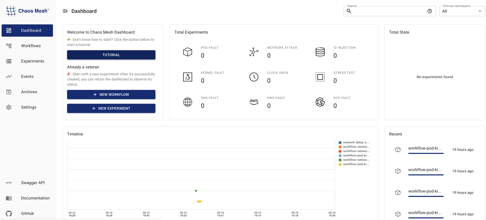

このドキュメントでは、Chaos Meshの基本機能について説明します。主な機能には[障害注入](#fault-injection)、[Chaosワークフロー](#chaos-workflows)、[可視化操作](#visualized-operations)、[セキュリティ保証](#security-guarantees)が含まれます。

## 障害注入

障害注入はChaos実験の核心です。Chaos Meshは分散システムで発生する可能性のあるあらゆる障害を網羅し、基本リソース障害、プラットフォーム障害、アプリケーション層障害という3つの包括的で詳細な障害タイプを提供します。

- 基本リソース障害:
  - [PodChaos](simulate-pod-chaos-on-kubernetes.md): Podの再起動、Podの持続的な利用不可、特定のPod内のコンテナ障害など、Podの障害をシミュレートします。
  - [NetworkChaos](simulate-network-chaos-on-kubernetes.md): ネットワーク遅延、パケット損失、パケット順序の乱れ、ネットワーク分断など、ネットワーク障害をシミュレートします。
  - [DNSChaos](simulate-dns-chaos-on-kubernetes.md): DNSドメイン名の解決失敗や誤ったIPアドレスの返却など、DNS障害をシミュレートします。
  - [HTTPChaos](simulate-http-chaos-on-kubernetes.md): HTTP通信の遅延など、HTTP通信障害をシミュレートします。
  - [StressChaos](simulate-heavy-stress-on-kubernetes.md): CPU競合やメモリ競合をシミュレートします。
  - [IOChaos](simulate-io-chaos-on-kubernetes.md): アプリケーションファイルのI/O遅延、読み書き失敗など、I/O障害をシミュレートします。
  - [TimeChaos](simulate-time-chaos-on-kubernetes.md): 時間のジャンプ異常をシミュレートします。
  - [KernelChaos](simulate-kernel-chaos-on-kubernetes.md): アプリケーションのメモリ割り当て異常など、カーネル障害をシミュレートします。
- プラットフォーム障害:
  - [AWSChaos](simulate-aws-chaos.md): AWSノードの再起動など、AWSプラットフォームの障害をシミュレートします。
  - [GCPChaos](simulate-gcp-chaos.md): GCPノードの再起動など、GCPプラットフォームの障害をシミュレートします。
- アプリケーション障害:
  - [JVMChaos](simulate-jvm-application-chaos.md): 関数呼び出しの遅延など、JVMアプリケーションの障害をシミュレートします。

## Chaosワークフロー

Chaosワークフローは、一連のChaos実験とアプリケーション状態チェックを含むため、プラットフォーム上でChaosエンジニアリングプロジェクトの全プロセスを完了できます。

Chaosワークフローを使用すると、一連のChaos実験を実行し、爆発半径（攻撃範囲）を拡大しながら障害タイプを増やすことができます。Chaosワークフローを実行後、Chaos Meshを使用してアプリケーションの現在の状態を簡単に確認し、追跡実験を行うかどうかを判断できます。同時に、Chaosワークフローのメンテナンスコストを削減するため、既存の実験ワークフローを更新・蓄積し、他のワークフローに適用できます。

現在、Chaosワークフローは以下の機能を提供します:

- 直列的なChaos実験のオーケストレーション
- 並列的なChaos実験のオーケストレーション
- 実験状態と結果のチェックサポート
- Chaos実験の一時停止サポート
- YAMLファイルを使用したChaosワークフローの定義と管理サポート
- Web UIを使用したChaosワークフローの定義と管理サポート

特定のワークフローの設定については、[Chaos Meshワークフローの作成](create-chaos-mesh-workflow.md)を参照してください。

## 可視化操作

Chaos Meshは可視化操作のためのChaos Dashboardコンポーネントを提供し、Chaos実験を大幅に簡素化します。可視化インターフェースを通じて直接Chaos実験を管理・監視できます。例えば、インターフェース上で数回クリックするだけで、Chaos実験の範囲を定義し、障害注入タイプを指定し、スケジューリングルールを定義し、Chaos実験の結果を取得できます。

## セキュリティ保証

Chaos Meshは、Kubernetesのネイティブな[RBAC](https://kubernetes.io/docs/reference/access-authn-authz/rbac/)機能を使用して権限を管理します。

実際の権限要件に基づいて複数のロールを自由に作成し、それらのロールをユーザー名サービスアカウントにバインドできます。その後、サービスアカウントに対応するトークンを生成します。このトークンを使用してDashboardにログインすると、サービスアカウントに与えられた権限の範囲内でのみChaos実験を実行できます。

さらに、namespaceアノテーションを設定することでChaos実験を許可するnamespaceを指定でき、Chaos実験の制御をさらに強化できます。