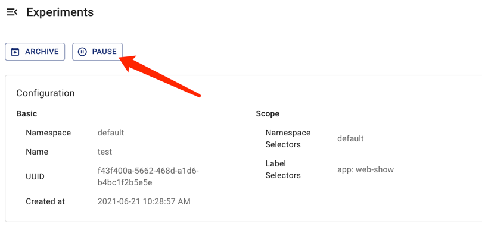

このドキュメントでは、Chaos Meshでカオス実験を作成、実行、表示、一時停止、更新、および削除する方法について説明します。

## カオス実験の作成

Chaos Meshでは以下のタイプのカオス実験を作成できます:

- 1回限りのカオス実験: カオス実験の最小単位。1回限りの実験が作成されると、Chaos Meshは実験設定に従って即座にターゲットテストマシンに障害を注入します。`duration`パラメータが設定されている場合、注入された障害は`duration`で指定された時間後に自動的に復旧します。カオス実験が一時停止または削除されると、注入された障害は即座に復旧します。
- スケジュールまたは周期的なカオス実験: 定期的な間隔または周期的に実行できるカオス実験。このタイプのカオス実験を作成する際には、実験のスケジューリングルールを定義する必要があります。

### 1回限りのカオス実験

1回限りのカオス実験を作成するには、以下のいずれかの方法を使用できます:

- Chaos Dashboardを使用して新しいカオス実験を作成し、「Submit」をクリックして実験を実行します。詳細は各カオス実験タイプのドキュメントを参照してください。
- YAMLファイルを使用してカオス実験を定義し、`kubectl`を使用して実験を作成・実行します。この方法でカオス実験を作成・実行する場合は、以下の手順に従ってください:

1. 新しいYAMLファイルを作成してカオス実験を定義します。作成したいカオス実験のタイプに基づいてファイルに設定パラメータを追加します。

   NetworkChaos実験を例として、以下のYAMLテキストを`network-delay.yaml`として保存します。

   ```yaml
   apiVersion: chaos-mesh.org/v1alpha1
   kind: NetworkChaos
   metadata:
     name: network-delay
   spec:
     action: delay # 注入する具体的なカオスアクション
     mode: one # カオスアクションを実行するモード。サポートされるモードはone/all/fixed/fixed-percent/random-max-percent
     selector: # カオスアクションを注入するポッド
       namespaces:
         - default
       labelSelectors:
         'app': 'web-show' # カオス注入対象のポッドのラベル
     delay:
       latency: '10ms'
     duration: '12s'
   ```

   上記のYAML例は、`default`ネームスペース内の`"app": "web-show"`タグを持つアプリケーションを対象とした、`12秒間`持続するネットワーク遅延障害を定義しています。NetworkChaos実験の詳細な設定情報については、[Simulate network chaos](simulate-network-chaos-on-kubernetes.md)を参照してください。

2. 以下のコマンドを実行してこのカオス実験を作成・実行します。

   ```sh
   kubectl apply -f network-delay.yaml
   ```

3. カオス実験の開始後の実行ステータスを確認するには、以下の`kubectl describe`コマンドを使用してこの実験オブジェクトの`status`または`event`を確認します。

   ```sh
   kubectl describe networkchaos network-delay
   ```

   カオス実験の結果を確認する詳細な手順については、[Inspect Chaos experiments](inspect-chaos-experiments.md)を参照してください。

### スケジュールまたは周期的なカオス実験

Chaos Meshは`Schedule`オブジェクトを提供して、スケジュールされたカオス実験と周期的なカオス実験を作成します。

このタイプのカオス実験を作成するには、以下の手順に従ってください:

1. 新しいYAMLファイルを作成し、Chaos実験を定義します。YAMLファイル内で`Schedule`パラメータを設定して実験の具体的なスケジュールルールを定義し、作成するChaos実験のタイプに応じて他のパラメータを設定する必要があります。

   スケジュールされたNetworkChaos実験を例として、以下のYAMLテキストを`schedule-delay-example.yaml`として保存します。

   ```yaml
   apiVersion: chaos-mesh.org/v1alpha1
   kind: Schedule
   metadata:
     name: schedule-delay-example
   spec:
     schedule: '5 * * * *'
     historyLimit: 2
     concurrencyPolicy: 'Allow'
     type: 'NetworkChaos'
     networkChaos:
       action: delay
       mode: one
       selector:
         namespaces:
           - default
         labelSelectors:
           'app': 'web-show'
       delay:
         latency: '10ms'
       duration: '12s'
   ```

   上記のYAML例は、毎時5分に自動的にトリガーされるネットワーク遅延障害を定義しています。スケジュールルールの詳細については、[スケジュールルールの定義](define-scheduling-rules.md)を参照してください。

   :::note

   `duration`パラメータを設定しない場合、障害の動作はChaos実験を一時停止または削除するまで継続して有効になります。

   :::

2. 以下のコマンドを実行して、このChaos実験を作成および実行します。

   ```sh
   kubectl apply -f schedule-delay-example.yaml
   ```

3. Chaos実験が開始した後の実行ステータスを確認するには、以下の`kubectl describe`コマンドを使用して、この実験オブジェクトの`status`または`event`を確認します。

   ```sh
   kubectl describe networkchaos schedule-delay-example
   ```

   Chaos実験の結果を確認する詳細な手順については、[Chaos実験の検査](inspect-chaos-experiments.md)を参照してください。

## Chaos実験の一時停止

### コマンドを使用したChaos実験の一時停止または再開

実行中のChaos実験に対して、コマンドを使用して一時停止アノテーションを設定することで、実験を一時停止できます。

例えば、以下のコマンドを使用して、デフォルト名前空間にある`network-delay`という名前のChaos実験を一時停止できます：

```sh
kubectl annotate networkchaos network-delay experiment.chaos-mesh.org/pause=true
```

このコマンドが実行されると、Chaos Meshは注入された障害を直ちに復元します。一時停止状態から通常の実行状態にChaos実験を再開したい場合は、以下のコマンドを使用します：

```sh
kubectl annotate networkchaos network-delay experiment.chaos-mesh.org/pause-
```

### Chaos Dashboardを使用したChaos実験の一時停止または再開

Chaos Dashboardを使用してChaos実験を一時停止または再開する場合は、Dashboard上で対象のChaos実験を見つけ、**一時停止**ボタンまたは**開始**ボタンをクリックします。




## Chaos実験の更新

### コマンドを使用したChaos実験の更新

Chaos実験の`Spec`フィールドは現在、更新が許可されていません。

詳細については、関連する[GitHub issue](https://github.com/chaos-mesh/chaos-mesh/issues/2227)を参照してください。

### Chaos Dashboardを使用したChaos実験の更新

Chaos Dashboardは現在、Chaos実験の更新をサポートしていません。これはChaos実験の`Spec`フィールドが更新を許可していないためです。

## Chaos実験の削除

### コマンドを使用したChaos実験の削除

Chaos実験が終了した後、以下の`kubectl delete`コマンドを使用して実験を削除できます。Chaos実験を削除すると、注入された障害は直ちに復元されます：

```sh
kubectl delete -f network-delay.yaml
# or delete the chaos object directly
kubectl delete networkchaos network-delay
```

削除操作がブロックされる場合、これは対象オブジェクトの一部の障害動作が復元できないことを意味します。Chaos Meshのログを確認してトラブルシューティングを行うか、直接[GitHub issue](https://github.com/pingcap/chaos-mesh/issues)を作成してこの問題をChaos Meshチームに報告できます。また、以下のコマンドを使用してChaos実験を強制的に削除できます：

```sh
kubectl annotate networkchaos web-show-network-delay chaos-mesh.chaos-mesh.org/cleanFinalizer=forced
```

### Chaos Dashboardを使用したChaos実験の削除

Chaos DashboardでChaos実験を削除し、実験履歴にアーカイブしたい場合は、該当するChaos実験の**アーカイブ**ボタンをクリックしてください。

