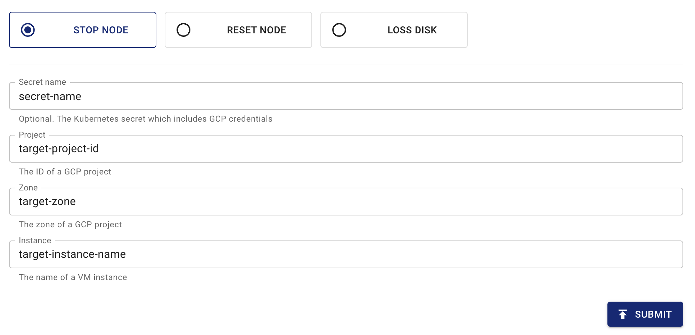

このドキュメントでは、Chaos Meshを使用してGCP Podに障害を注入する方法について説明します。Chaos DashboardとYAMLファイルを使用してGCPChaos実験を作成する手順を提供します。

## GCPChaosの概要

GCPChaosはChaos Meshの障害タイプの一つです。GCPChaos実験を作成することで、指定したGCPインスタンスの障害シナリオをシミュレートできます。現在、GCPChaosは以下の障害タイプをサポートしています：

- **Node Stop**: 指定したGCPインスタンスを停止します。
- **Node Reset**: 指定したGCPインスタンスを再起動します。
- **Disk Loss**: 指定したGCPインスタンスからストレージボリュームを切り離します。

## `Secret`ファイル

GCPクラスターに簡単に接続するために、認証情報を事前に保存するKubernetes `Secret`ファイルを作成できます。

以下は`secret`ファイルのサンプルです：

```yaml
apiVersion: v1
kind: Secret
metadata:
  name: cloud-key-secret
  namespace: chaos-mesh
type: Opaque
stringData:
  service_account: your-gcp-service-account-base64-encode
```

- **name**はKubernetesシークレットの名前を定義します。
- **namespace**はKubernetesシークレットの名前空間を定義します。
- **service_account**はGCPクラスターのサービスアカウントキーを保存します。GCPサービスアカウントキーは[Base64](https://ja.wikipedia.org/wiki/Base64)エンコードを完了していることを確認してください。サービスアカウントキーの詳細については、[サービスアカウントキーの作成と管理](https://cloud.google.com/iam/docs/creating-managing-service-account-keys)を参照してください。

## Chaos Dashboardを使用した実験の作成

:::note

Chaos Dashboardを使用して実験を作成する前に、以下の要件を満たしていることを確認してください：

1. Chaos Dashboardがインストールされていること。
2. `kubectl port-forward`コマンドを使用してChaos Dashboardにアクセスできること：

   ```bash
   kubectl port-forward -n chaos-mesh svc/chaos-dashboard 2333:2333
   ```

   その後、ブラウザで[`http://localhost:2333`](http://localhost:2333)にアクセスしてダッシュボードを利用できます。

:::

1. Chaos Dashboardを開き、ページ上の**NEW EXPERIMENT**をクリックして新しい実験を作成します：

   

2. **Choose a Target**エリアで、**GCP fault**を選択し、**STOP NODE**などの具体的な動作を選択します：

   

3. 実験情報を入力し、実験範囲と予定された実験期間を指定します：

   

   

4. 実験情報を送信します。

## YAMLファイルを使用した実験の作成

### `node-stop`設定例

1. 実験設定を`gcpchaos-node-stop.yaml`に以下のように記述します：

   ```yaml
   apiVersion: chaos-mesh.org/v1alpha1
   kind: GCPChaos
   metadata:
     name: node-stop-example
     namespace: chaos-mesh
   spec:
     action: node-stop
     secretName: 'cloud-key-secret'
     project: 'your-project-id'
     zone: 'your-zone'
     instance: 'your-instance-name'
     duration: '5m'
   ```

   この設定例に基づき、Chaos Meshは指定したGCPインスタンスに`node-stop`障害を注入し、GCPインスタンスは5分間利用不可になります。

   GCPインスタンスの停止に関する詳細は、[GCPインスタンスの停止](https://cloud.google.com/compute/docs/instances/stop-start-instance)を参照してください。

2. 設定ファイルの準備ができたら、`kubectl`を使用して実験を作成します：

   ```bash
   kubectl apply -f gcpchaos-node-stop.yaml
   ```

### `node-reset`設定例

1. 実験設定を `gcpchaos-node-reset.yaml` に以下のように記述します:

   ```yaml
   apiVersion: chaos-mesh.org/v1alpha1
   kind: GCPChaos
   metadata:
     name: node-reset-example
     namespace: chaos-mesh
   spec:
     action: node-reset
     secretName: 'cloud-key-secret'
     project: 'your-project-id'
     zone: 'your-zone'
     instance: 'your-instance-name'
     duration: '5m'
   ```

   この設定例に基づき、Chaos Meshは指定されたGCPインスタンスに `node-reset` 障害を注入し、GCPインスタンスがリセットされます。

   GCPインスタンスのリセットに関する詳細は、[GCPインスタンスのリセット](https://cloud.google.com/compute/docs/instances/stop-start-instance#resetting_an_instance)を参照してください。

2. 設定ファイルの準備が完了したら、`kubectl` を使用して実験を作成します:

   ```bash
   kubectl apply -f gcpchaos-node-reset.yaml
   ```

### `disk-loss` 設定例

1. 実験設定を `gcpchaos-disk-loss.yaml` に以下のように記述します:

   ```yaml
   apiVersion: chaos-mesh.org/v1alpha1
   kind: GCPChaos
   metadata:
     name: disk-loss-example
     namespace: chaos-mesh
   spec:
     action: disk-loss
     secretName: 'cloud-key-secret'
     project: 'your-project-id'
     zone: 'your-zone'
     instance: 'your-instance-name'
     deviceNames: ['disk-name']
     duration: '5m'
   ```

   この設定例に基づき、Chaos Meshは指定されたGCPインスタンスに `disk-loss` 障害を注入し、5分以内にGCPインスタンスから指定されたストレージボリュームが切り離されます。

   GCPストレージの切り離しに関する詳細は、[GCPストレージの切り離し](https://cloud.google.com/compute/docs/reference/rest/v1/instances/detachDisk)を参照してください。

2. 設定ファイルの準備が完了したら、`kubectl` を使用して実験を作成します:

   ```bash
   kubectl apply -f gcpchaos-disk-loss.yaml
   ```

### フィールド説明

以下の表にYAML設定ファイルのフィールドを示します。

| Parameter | Type | Descpription | Default value | Required | Example |
| --- | --- | --- | --- | --- | --- |
| action | string | Indicates the specific type of faults. The available fault types include node-stop, node-reset, and disk-loss. | node-stop | Yes | node-stop |
| mode | string | Indicates the mode of the experiment. The mode options include `one` (selecting a Pod at random), `all` (selecting all eligible Pods), `fixed` (selecting a specified number of eligible Pods), `fixed-percent` (selecting a specified percentage of the eligible Pods), and `random-max-percent` (selecting the maximum percentage of the eligible Pods). | None | Yes | `one` |
| value | string | Provides parameters for the `mode` configuration, depending on `mode`. For example, when `mode` is set to `fixed-percent`, `value` specifies the percentage of pods. | None | No | 1 |
| secretName | string | Indicates the name of the Kubernetes secret that stores the GCP authentication information. | None | No | cloud-key-secret |
| project | string | Indicates the ID of GCP project. | None | Yes | real-testing-project |
| zone | string | Indicates the region of GCP instance. | None | Yes | us-central1-a |
| instance | string | Indicates the name of GCP instance. | None | Yes | gke-xxx-cluster--default-pool-xxx-yyy |
| deviceNames | []string | This is a required field when the `action` is `disk-loss`. This field specifies the machine disk ID. | None | no | ["your-disk-id"] |
| duration | string | Indicates the duration of the experiment. | None | Yes | 30s |