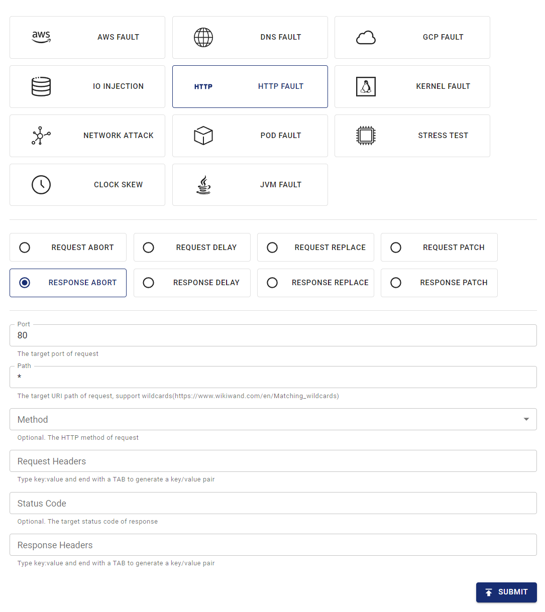

このドキュメントでは、Chaos MeshでHTTPChaos実験を作成してHTTP障害をシミュレートする方法について説明します。

## HTTPChaosの紹介

HTTPChaosはChaos Meshが提供する障害タイプです。HTTPChaos実験を作成することで、HTTPリクエストとレスポンス処理中の障害シナリオをシミュレートできます。現在、HTTPChaosは以下の障害タイプのシミュレーションをサポートしています：

- `abort`: 接続を中断する
- `delay`: リクエストまたはレスポンスに遅延を注入する
- `replace`: HTTPリクエストまたはレスポンスメッセージの一部を置換する
- `patch`: HTTPリクエストまたはレスポンスメッセージに追加コンテンツを付与する

HTTPChaosは異なる障害タイプの組み合わせをサポートしています。HTTPChaos実験作成時に複数のHTTP障害タイプを同時に設定した場合、実験開始時に障害が注入される順序は`abort` -> `delay` -> `replace` -> `patch`となります。`abort`障害によって短絡が発生した場合、接続は直接中断されます。

HTTPChaos設定の詳細な説明については、以下の[フィールド説明](#field-description)を参照してください。

## 注意事項

HTTPChaosがサポートする障害を注入する前に、以下の点に注意してください：

- ターゲットPod上でChaos Meshのコントロールマネージャーが実行されていないこと
- ルールはPod内のクライアントとサーバーの両方に影響を与えます。片方のみに影響させたい場合は、[影響範囲の指定](#specify-side)セクションを参照してください
- HTTPSアクセスは無効にする必要があります（現在HTTPS接続への注入はサポートされていません）
- HTTPChaosの注入を有効にするため、クライアントはTCPソケットの再利用を避ける必要があります。これはHTTPChaosが障害注入前にTCPソケット経由で送信されたHTTPリクエストに影響を与えないためです
- 本番環境では非冪等リクエスト（ほとんどのPOSTリクエストなど）の使用に注意してください。このようなリクエストを使用した場合、障害注入後にリクエストを繰り返してもターゲットサービスが正常状態に戻らない可能性があります

## Chaos Dashboardを使用した実験の作成

1. Chaos Dashboardを開き、ページ上の**NEW EXPERIMENT**をクリックして新しい実験を作成します：

   

2. **Choose a Target**エリアで、**HTTP FAULT**を選択し、`RESPONSE ABORT`などの特定の動作を選択します。その後、具体的な設定を入力します。

   

3. 実験を送信します。

   上記の例では、ポート80のすべてのリクエストに「Response abort」障害を注入するように設定しています。

## YAMLファイルを使用した実験の作成

Chaos MeshはYAML設定ファイルを使用したHTTPChaos実験の作成もサポートしています。YAMLファイルでは、単一のHTTP障害タイプまたは複数のHTTP障害タイプの組み合わせをシミュレートできます。

### `abort`の例

1. 以下の例のように、実験設定を`http-abort-failure.yaml`ファイルに記述します：

   ```yaml
   apiVersion: chaos-mesh.org/v1alpha1
   kind: HTTPChaos
   metadata:
     name: test-http-chaos
   spec:
     mode: all
     selector:
       labelSelectors:
         app: nginx
     target: Request
     port: 80
     method: GET
     path: /api
     abort: true
     duration: 5m
   ```

   この設定例に基づき、Chaos Meshは指定されたPodに5分間`abort`障害を注入します。障害注入中、ターゲットPodのポート80を通じて`/api`パスに送信されるGETリクエストは中断されます。

2. 設定ファイルの準備ができたら、`kubectl`を使用して実験を作成します：

   ```bash
   kubectl apply -f ./http-abort-failure.yaml
   ```

### 障害組み合わせの例

1. 以下の例のように、実験設定を `http-failure.yaml` ファイルに記述します：

   ```yaml
   apiVersion: chaos-mesh.org/v1alpha1
   kind: HTTPChaos
   metadata:
     name: test-http-chaos
   spec:
     mode: all
     selector:
       labelSelectors:
         app: nginx
     target: Request
     port: 80
     method: GET
     path: /api/*
     delay: 10s
     replace:
       path: /api/v2/
       method: DELETE
     patch:
       headers:
         - ['Token', '<one token>']
         - ['Token', '<another token>']
       body:
         type: JSON
         value: '{"foo": "bar"}'
     duration: 5m
   ```

   この設定例に基づき、Chaos Mesh は `delay` 障害、`replace` 障害、`patch` 障害を順番に注入します。

2. 設定ファイルの準備ができたら、`kubectl` を使用して実験を作成します：

   ```bash
   kubectl apply -f ./http-failure.yaml
   ```

## フィールド説明

### 共通フィールドの説明

共通フィールドは、障害注入の `target` が `Request` または `Response` の場合に意味を持ちます。

| Parameter | Type | Description | Default value | Required | Example |
| --- | --- | --- | --- | --- | --- |
| `mode` | string | Specifies the mode of the experiment. The mode options include `one` (selecting a random pod), `all` (selecting all eligible pods), `fixed` (selecting a specified number of eligible pods), `fixed-percent` (selecting a specified percentage of Pods from the eligible pods), and `random-max-percent` (selecting the maximum percentage of Pods from the eligible pods). |  | yes | `one` |
| `value` | string | Provides parameters for the `mode` configuration depending on the value of `mode`. |  | no | 1 |
| `target` | string | Specifies whether the target of fault injuection is `Request` or `Response`. The [`target`-related fields](#description-for-target-related-fields) should be configured at the same time. |  | yes | Request |
| `port` | int32 | The TCP port that the target service listens on. |  | yes | 80 |
| `path` | string | The URI path of the target request. Supports [Matching wildcards](https://www.wikiwand.com/en/Matching_wildcards). | Takes effect on all paths by default. | no | /api/\* |
| `method` | string | The HTTP method of the target request method. | Takes effect for all methods by default. | no | GET |
| `request_headers` | map[string]string | Matches request headers to the target service. | Takes effect for all requests by default. | no | Content-Type: application/json |
| `abort` | bool | Indicates whether to inject the fault that interrupts the connection. | false | no | true |
| `delay` | string | Specifies the time for a latency fault. | 0 | no | 10s |
| `replace.headers` | map[string]string | Specifies the key pair used to replace the request headers or response headers. |  | no | Content-Type: application/xml |
| `replace.body` | []byte | Specifies request body or response body to replace the fault (Base64 encoded). |  | no | eyJmb28iOiAiYmFyIn0K |
| `patch.headers` | [][]string | Specifies the attached key pair of the request headers or response headers with patch faults. |  | no | - [Set-Cookie, one cookie] |
| `patch.body.type` | string | Specifies the type of patch faults of the request body or response body. Currently, it only supports [`JSON`](https://tools.ietf.org/html/rfc7396). |  | no | JSON |
| `patch.body.value` | string | Specifies the fault of the request body or response body with patch faults. |  | no | `{"foo": "bar"}` |
| `duration` | string | Specifies the duration of a specific experiment. |  | yes | 30s |
| `scheduler` | string | Specifies the scheduling rules for the time of a specific experiment. |  | no | 5 \* \* \* \* |
| `tls.secretName` | string | SecretName represents the name of required secret resource. The secrete must combined with data `{"tls.certName":cert, "tls.KeyName":key, "tls.caName":ca}` |  | no | "http-tls-scr" |
| `tls.secretNamespace` | string | SecretNamespace represents the namespace of required secret resource,should be the same with deployment/chaos-controller-manager in most cases |  | no | "chaos-mesh" |
| `tls.certName` | string | CertName represents the data name of cert file in secret, `tls.crt` for example |  | no | "tls.crt" |
| `tls.KeyName` | string | KeyName represents the data name of key file in secret, `tls.key` for example |  | no | "tls.key" |
| `tls.caName` | string | CAName represents the data name of ca file in secret, `ca.crt` for example |  | no | "ca.crt" |

:::note

- YAML ファイルで実験を作成する場合、`replace.body` は置換内容の base64 エンコーディングである必要があります。

- Kubernetes API で実験を作成する場合、置換内容をエンコードする必要はなく、`[]byte` に変換して `httpchaos.Spec.Replace.Body` フィールドに設定するだけです。以下は例です：

```golang
httpchaos.Spec.Replace.Body = []byte(`{"foo": "bar"}`)
```

:::

### `target` 関連フィールドの説明

#### `Request` 関連フィールド

`Request` フィールドは、障害注入時に `target` が `Request` に設定されている場合に意味を持ちます。

| Parameter | Type | Description | Default value | Required | Example |
| --- | --- | --- | --- | --- | --- |
| `replace.path` | string | Specifies the URI path used to replace content. |  | no | /api/v2/ |
| `replace.method` | string | Specifies the replaced content of the HTTP request method. |  | no | DELETE |
| `replace.queries` | map[string]string | Specifies the replaced key pair of the URI query. |  | no | foo: bar |
| `patch.queries` | [][]string | Specifies the attached key pair of the URI query with patch faults. |  | no | - [foo, bar] |

#### `Response` 関連フィールド

`Response` フィールドは、障害注入時に `target` が `Response` に設定されている場合に意味を持ちます。

| Parameter | Type | Description | Default value | Required | Example |
| --- | --- | --- | --- | --- | --- |
| `code` | int32 | Specifies the status code responded by `target`. | Takes effect for all status codes by default. | no | 200 |
| `response_headers` | map[string]string | Matches request headers to `target`. | Takes effect for all responses by default. | no | Content-Type: application/json |
| `replace.code` | int32 | Specifies the replaced content of the response status code. |  | no | 404 |

## 影響側の指定

デフォルトでは、ルールは Pod 内のクライアントとサーバーの両方に影響を与えますが、リクエストヘッダーを選択することで片側のみに影響を与えることができます。

このセクションでは、影響を受ける側を指定するためのいくつかの例を提供します。特定のケースに応じてルール内のヘッダーセレクターを調整できます。

### クライアント側

サーバーに影響を与えずに Pod 内のクライアントに障害を注入するには、リクエスト内の `Host` ヘッダーでリクエスト/レスポンスを選択できます。

例えば、`http://example.com/` へのすべてのリクエストを中断したい場合、以下の YAML 設定を適用できます：

```yaml
apiVersion: chaos-mesh.org/v1alpha1
kind: HTTPChaos
metadata:
  name: test-http-client
spec:
  mode: all
  selector:
    labelSelectors:
      app: some-http-client
  target: Request
  port: 80
  path: '*'
  request_headers:
    Host: 'example.com'
  abort: true
```

### サーバー側

クライアントに影響を与えずに Pod 内のサーバーに障害を注入するには、リクエスト内の `Host` ヘッダーでリクエスト/レスポンスを選択することもできます。

例えば、サービス `nginx.nginx.svc` の背後にあるサーバーへのすべてのリクエストを中断したい場合、以下の YAML 設定を適用できます：

```yaml
apiVersion: chaos-mesh.org/v1alpha1
kind: HTTPChaos
metadata:
  name: test-http-server
spec:
  mode: all
  selector:
    labelSelectors:
      app: nginx
  target: Request
  port: 80
  path: '*'
  request_headers:
    Host: 'nginx.nginx.svc'
  abort: true
```

他のケース、特に外部からのインバウンドリクエストに障害を注入する場合、リクエスト内の `X-Forwarded-Host` ヘッダーでリクエスト/レスポンスを選択することがあります。

例えば、パブリックゲートウェイ `nginx.host.org` の背後にあるサーバーへのすべてのリクエストを中断したい場合、以下の YAML 設定を適用できます：

```yaml
apiVersion: chaos-mesh.org/v1alpha1
kind: HTTPChaos
metadata:
  name: test-http-server
spec:
  mode: all
  selector:
    labelSelectors:
      app: nginx
  target: Request
  port: 80
  path: '*'
  request_headers:
    X-Forwarded-Host: 'nginx.host.org'
  abort: true
```

## TLS

TLS ベースの接続内に障害を注入するには、ユーザーは TLS モードを使用する必要があります。ここではプロキシがプロキシ役を果たすため、TLS では信頼できる CA を持つリモートサーバーとして動作する必要があると同時に、特定の CA を信頼するクライアントとしても動作する必要があります。

そのため、以下のシークレットデータでは、ユーザー自身がTLSキー、CA、CRTを作成する必要があります。

```
{
  "tls.certName":cert,
  "tls.KeyName":key,
  "tls.caName":ca
}
```

ユーザーが新しいTLSサーバーを作成し、その接続に障害を注入する必要がある場合、以下の手順を実行する必要があります:

1. 独自のルートCAの秘密鍵とルートCAの証明書を作成します:

   ```
   openssl req -newkey rsa:4096  -x509  -sha512  -days 365 -nodes -out ca.crt -keyout ca.key
   ```

2. サーバーの証明書署名要求（CSR）を作成します:

   ```
   openssl genrsa -out server.key 2048
   openssl req -new -key server.key -out server.csr
   ```

3. サーバー用の拡張ファイル `server.ext` を以下のように作成します:

   ```
   authorityKeyIdentifier=keyid,issuer
   basicConstraints=CA:FALSE
   keyUsage = digitalSignature, nonRepudiation, keyEncipherment, dataEncipherment
   subjectAltName = @alt_names

   [alt_names]
   IP.1 = X.X.X.X
   ```

4. サーバーの証明書を生成します:

   ```
   openssl x509 -req -in server.csr -CA ca.crt -CAkey ca.key -CAcreateserial -out server.crt -days 365 -sha256 -extfile server.ext
   ```

5. クライアントにCA `ca.crt` を追加します。

6. `server.key`、`server.crt`、`ca.crt` をシークレットに配置し、TLSモードに渡します。

ユーザーがクライアントに障害を注入する必要がある場合、HTTP Chaosのプロキシをリモートサーバーとして動作させる必要があります。そのためには、上記の `server.ext` を特定のドメインに編集するだけです。

例:

```
subjectAltName = @alt_names

[alt_names]
DNS.1 = *.domain.com
IP.1 = xxx.xxx.xxx.xxx
```

## ローカルデバッグ

特定の障害注入の効果が不明な場合、[rs-tproxy](https://github.com/chaos-mesh/rs-tproxy) を使用してローカルで対応する機能をテストすることもできます。Chaos Meshは、chaos-tproxyを使用してHTTP Chaosも提供しています。