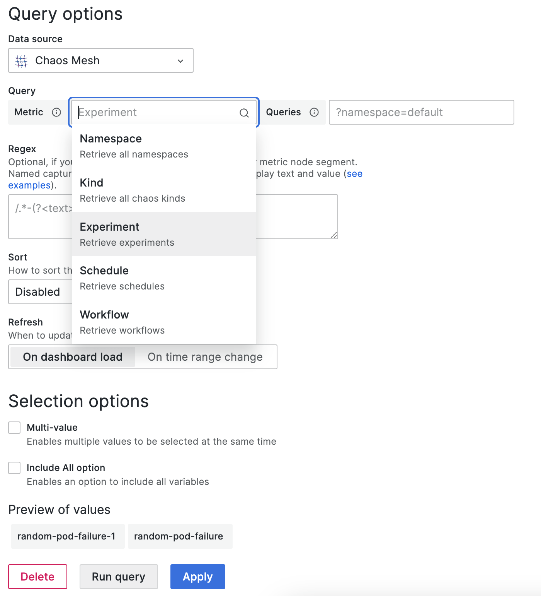

このドキュメントでは、Grafana用のデータソースプラグインをインストールし、Chaos Meshイベントを監視するための設定方法について説明します。

:::note

このプラグインにはChaos Mesh **>=2.1**、Grafana >= **10.0**が必要です。

プラグインはGrafana 10.0.3でテストされていますが、それ以前のバージョンでも動作する可能性があります（未確認）。Grafana v10へのアップグレードは[Angularサポートの廃止](https://github.com/chaos-mesh/datasource/issues/55)に伴うものです。問題が発生した場合は、issueを開いてお知らせください。

:::

## インストール

### ダッシュボードを使用する場合

[https://grafana.com/docs/grafana/latest/administration/plugin-management/#install-a-plugin](https://grafana.com/docs/grafana/latest/administration/plugin-management/#install-a-plugin)

### CLIを使用する場合

```sh
grafana-cli plugins install chaosmeshorg-datasource
```

### 手動インストール

以下のコマンドでプラグインのzipパッケージをダウンロードするか、https://github.com/chaos-mesh/datasource/releases からダウンロードしてください：

```shell
curl -LO https://github.com/chaos-mesh/datasource/releases/download/v3.0.0/chaosmeshorg-datasource-3.0.0.zip
```

ダウンロード後、解凍します：

```shell
unzip chaosmeshorg-datasource-3.0.0.zip -d YOUR_PLUGIN_DIR
```

:::tip

プラグインディレクトリの場所については、https://grafana.com/docs/grafana/latest/plugins/installation/#install-a-packaged-plugin を参照してください。

:::

次に、`grafana.ini`ファイルを更新して保存します：

```ini
[plugins]
  allow_loading_unsigned_plugins = chaosmeshorg-datasource
```

:::tip

設定ファイルの場所については、https://grafana.com/docs/grafana/latest/administration/configuration/#config-file-locations を参照してください。

:::

最後に、Grafanaを再起動してプラグインを読み込みます。

## 設定

インストール後、**管理 -> データソース**に移動し、Chaos Meshを追加して設定ページに進みます：


Chaos Meshがローカルにインストールされている場合、Chaos Dashboardはデフォルトでポート`2333`でAPIを公開します。特に変更していない場合は、`http://localhost:2333`と入力してください。

次に、`port-forward`コマンドを使用してAPIを外部からアクセス可能にします：

```shell
kubectl port-forward -n chaos-mesh svc/chaos-dashboard 2333:2333
```

最後に、**保存 & テスト**をクリックして接続をテストします。成功通知が表示されれば設定は完了です。

### 認証

[権限認証](./manage-user-permissions.md)を有効にしてChaos Meshをデプロイした場合、設定に`Authorization`ヘッダーを追加する必要があります。以下の手順に従ってヘッダーを追加してください：

1. **ヘッダー追加**ボタンをクリックします。
2. **ヘッダー**フィールドに`Authorization`と入力します。
3. [このセクション](./manage-user-permissions.md#get-the-token)に従ってトークンを取得します。
4. **値**フィールドに`Bearer YOUR_TOKEN`と入力します。

その後、忘れずに**保存 & テスト**をクリックして接続をテストしてください。

## クエリ

データソースプラグインはイベントを通じてChaos Meshを監視し、以下のオプションで異なるイベントをフィルタリングします：

- **オブジェクトID**

  > オブジェクトのuuidでフィルタリングします。

- **Namespace**

  > 異なるnamespaceでフィルタリングします。

- **名前**

  > オブジェクト名でフィルタリングします。

- **Kind**

  > 種類（PodChaos、NetworkChaos、Scheduleなど）でフィルタリングします。Chaos Meshで新しいkindを実装した場合、任意のkindを入力することも可能です。

- **制限**

  > イベント数の上限を設定します。

これらはすべて`/api/events` APIにパラメータとして渡されます。

## 変数

データソースプラグインは、異なるメトリクスによるクエリ変数の追加をサポートしています：



- **Namespace（ネームスペース）**

  > 選択後、利用可能なすべてのネームスペースが **Preview of values** に直接表示されます。

- **Kind（種類）**

  > **Namespace** と同様です。すべての種類を取得します。

- **Experiment/Schedule/Workflow（実験/スケジュール/ワークフロー）**

  > **Namespace** と同様です。現在のすべての実験/スケジュール/ワークフローを取得します。
  >
  > さらに値をフィルタリングするために `queries` を指定することも可能です。例えば、`?namespace=default` とすると `default` ネームスペース内の実験/スケジュール/ワークフローのみを取得します。

## アノテーション

アノテーションを通じてイベントをパネルに統合できます。以下はサンプルの作成例で、すべてのPodChaosイベントを取得します：


対応するフィールドの入力については、[クエリ](#query)を参照してください。

## 質問とフィードバック

インストールやセットアップ中に問題が発生した場合は、[CNCF Slack](https://cloud-native.slack.com/archives/C0193VAV272)でコミュニティに質問するか、[GitHub issue](https://github.com/chaos-mesh/datasource/issues)を作成してChaos Meshチームと連絡を取ることができます。

## 次のステップ

Data Sourceプラグインの詳細についてさらに学びたい場合は、[chaos-mesh/datasource](https://github.com/chaos-mesh/datasource)のソースコードを自由に確認してください。