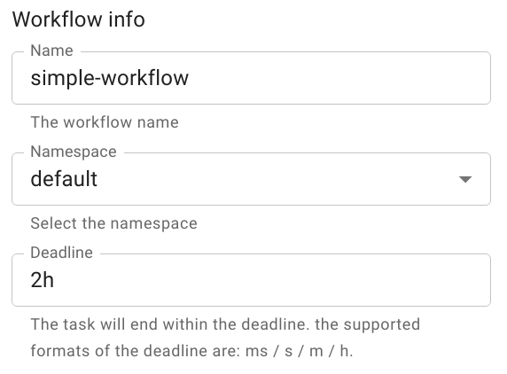
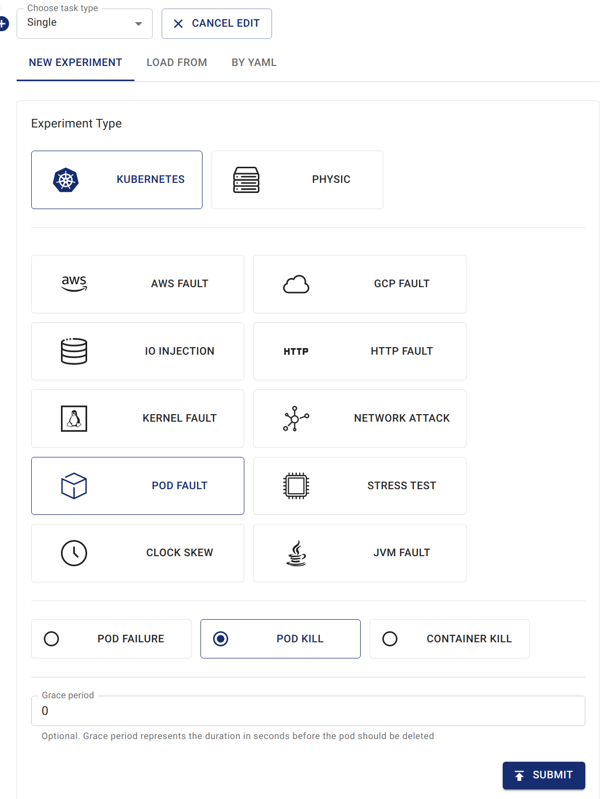

## Chaos Meshワークフローの概要

Chaos Meshを使用して実際のシステム障害をシミュレートする際、継続的な検証が必要となる場合があります。個別のカオスインジェクションを実行するのではなく、Chaos Meshプラットフォーム上で一連の障害を構築したいと考えるかもしれません。

このニーズに対応するため、Chaos Meshには組み込みのワークフローエンジンであるChaos Mesh Workflowが提供されています。このエンジンを使用することで、さまざまなカオス実験を直列または並列で実行し、本番環境レベルのエラーをシミュレートできます。

現在、Chaos Mesh Workflowでは以下の機能がサポートされています：

- 直列オーケストレーション
- 並列オーケストレーション
- カスタマイズタスク
- 条件分岐

代表的なユースケース：

- 並列オーケストレーションを使用して複数のNetworkChaos障害を注入し、複雑なネットワーク環境をシミュレート
- 直列オーケストレーションを使用してヘルスチェックを実行し、条件分岐で残りのステップを実行するかどうかを判断

Chaos Mesh Workflowの設計は、ある程度Argo Workflowsから影響を受けています。Argo Workflowsに慣れている場合、Chaos Mesh Workflowもすぐに使い始めることができます。

より多くのワークフローの例は、[Chaos Mesh GitHubリポジトリ](https://github.com/chaos-mesh/chaos-mesh/tree/master/examples/workflow)で確認できます。

## Chaos Dashboardを使用したワークフローの作成

### ステップ1. Chaos Dashboardを開く

**NEW WORKFLOW**をクリックします。


### ステップ2. ワークフローの基本情報を設定



### ステップ3. ワークフローのノードを設定

1. 必要に応じて**Choose task type**からオプションを選択します。

   この例では、タスクタイプとして「Single」タイプが選択されています。

   :::note

   Chaos Dashboardは自動的に「entry」という名前の直列ノードを作成し、このワークフローのエントリポイントとします。

   :::

   

2. 実験情報を入力します。

   設定方法は通常のカオス実験を作成する場合と同じです。例えば、「POD KILL」タイプの「PodChaos」を`kill-nginx`という名前で設定できます。

   

### ステップ4. ワークフローを送信

**Preview**でワークフロー定義を確認し、**SUBMIT WORKFLOW**をクリックしてワークフローを作成します。


## YAMLファイルと`kubectl`を使用したワークフローの作成

さまざまなタイプのChaosオブジェクトと同様に、ワークフローもKubernetesクラスター内でCRDとして存在します。`kubectl create -f <workflow.yaml>`を使用してChaos Meshワークフローを作成できます。以下のコマンドはワークフロー作成の例です。ローカルのYAMLファイルを使用してワークフローを作成します：

```shell
kubectl create -f <workflow.yaml>
```

ネットワーク上のYAMLファイルを使用してワークフローを作成します：

```shell
kubectl create -f https://raw.githubusercontent.com/chaos-mesh/chaos-mesh/master/examples/workflow/serial.yaml
```

シンプルなワークフローYAMLファイルの定義例を以下に示します。このワークフローでは、`StressChaos`、`NetworkChaos`、および`PodChaos`が注入されます：

```yaml
apiVersion: chaos-mesh.org/v1alpha1
kind: Workflow
metadata:
  name: try-workflow-parallel
spec:
  entry: the-entry
  templates:
    - name: the-entry
      templateType: Parallel
      deadline: 240s
      children:
        - workflow-stress-chaos
        - workflow-network-chaos
        - workflow-pod-chaos-schedule
    - name: workflow-network-chaos
      templateType: NetworkChaos
      deadline: 20s
      networkChaos:
        direction: to
        action: delay
        mode: all
        selector:
          labelSelectors:
            'app': 'hello-kubernetes'
        delay:
          latency: '90ms'
          correlation: '25'
          jitter: '90ms'
    - name: workflow-pod-chaos-schedule
      templateType: Schedule
      deadline: 40s
      schedule:
        schedule: '@every 2s'
        type: 'PodChaos'
        podChaos:
          action: pod-kill
          mode: one
          selector:
            labelSelectors:
              'app': 'hello-kubernetes'
    - name: workflow-stress-chaos
      templateType: StressChaos
      deadline: 20s
      stressChaos:
        mode: one
        selector:
          labelSelectors:
            'app': 'hello-kubernetes'
        stressors:
          cpu:
            workers: 1
            load: 20
            options: ['--cpu 1', '--timeout 600']
```

上記のYAMLテンプレートでは、`templates`フィールドが実験のステップを定義しています。`entry`フィールドは、ワークフローが実行される際のエントリポイントを定義します。

`templates`内の各要素はワークフローのステップを表します。例えば：

```yaml
name: the-entry
templateType: Parallel
deadline: 240s
children:
  - workflow-stress-chaos
  - workflow-network-chaos
  - workflow-pod-chaos
```

`templateType: Parallel` はノードタイプが並列実行であることを意味します。`deadline: 240s` は、このノード上のすべての並列実験が240秒以内に実行されることを期待していることを示します。それ以外の場合、実験はタイムアウトします。`children` は並列実行される他のテンプレート名を意味します。

例:

```yaml
name: workflow-pod-chaos
templateType: PodChaos
deadline: 40s
podChaos:
  action: pod-kill
  mode: one
  selector:
    labelSelectors:
      'app': 'hello-kubernetes'
```

`templateType: PodChaos` はノードタイプがPodChaos実験であることを意味します。`deadline: 40s` は現在のカオス実験が40秒間続くことを示します。`podChaos` はPodChaos実験の定義です。

YAMLファイルと`kubectl`を使用してワークフローを作成することは柔軟性があります。並列または直列のオーケストレーションをネストして複雑なオーケストレーションを宣言したり、オーケストレーションを条件分岐と組み合わせて循環効果を実現したりできます。

## フィールド説明

### ワークフローフィールド説明

| Parameter | Type | Description | Default value | Required | Example |
| --- | --- | --- | --- | --- | --- |
| entry | string | Declares the entry of the workflow. Its value is a name of a template. | None | Yes |  |
| templates | []Template | Declares the behavior of each step executable in the workflow. See [Template field description](#template-field-description) for details. | None | Yes |  |

### テンプレートフィールド説明

| Parameter | Type | Description | Default value | Required | Example |
| --- | --- | --- | --- | --- | --- |
| name | string | The name of the template, which needs to meet the DNS-1123 requirements. | None | Yes | any-name |
| type | string | Type of template. Value options are Task, Serial, Parallel, Suspend, Schedule, AWSChaos, DNSChaos, GCPChaos, HTTPChaos, IOChaos, JVMChaos, KernelChaos, NetworkChaos, PodChaos, StressChaos, and TimeChaos, StatusCheck. | None | Yes | PodChaos |
| deadline | string | The duration of the template. | None | No | '5m30s' |
| children | []string | Declares the subtasks under this template. You need to configure this field when the type is `Serial` or `Parallel`. | None | No | ["any-chaos-1", "another-serial-2", "any-shcedue"] |
| task | Task | Configures the customized task. You need to configure this field when the type is `Task`. See the [Task field description](#task-field-description) for details. | None | No |  |
| conditionalBranches | []ConditionalBranch | Configures the conditional branch which executes after customized task. You need to configure this field when the type is `Task`. See the [Conditional branch field description](#conditionalbranch-field-description) for details. | None | No |  |
| awsChaos | object | Configures AWSChaos. You need to configure this field when the type is `AWSChaos`. See the [Simulate AWS Faults](simulate-aws-chaos.md) document for details. | None | No |  |
| dnsChaos | object | Configures DNSChaos. You need to configure this field when the type is `DNSChaos`. See the [Simulate DNS Faults](simulate-dns-chaos-on-kubernetes.md) document for details. | None | No |  |
| gcpChaos | object | Configures GCPChaos. You need to configure this field when the type is `GCPChaos`.See the [Simulation GCP Faults](simulate-gcp-chaos.md) document for details. | None | No |  |
| httpChaos | object | Configures HTTPChaos. You need to configure this field when the type is `HTTPChaos`. See the [Simulate HTTP Faults](simulate-http-chaos-on-kubernetes.md) document for details. | None | No |  |
| ioChaos | object | Configure IOChaos. You need to configure this field when the type is `IOChaos`. See the [Simulate File I/O Faults](simulate-io-chaos-on-kubernetes.md) document for details. | None | No |  |
| jvmChaos | object | Configures JVMChaos. You need to configure this field when the type is `JVMChaos`. See the [Simulate JVM Application Faults](simulate-jvm-application-chaos.md) document for details. | None | No |  |
| kernelChaos | object | Configure KernelChaos. You need to configure this field when the type is `KernelChaos`. See the [Simulate Kernel Faults](simulate-kernel-chaos-on-kubernetes.md) document for details. | None | No |  |
| networkChaos | object | Configures NetworkChaos. You need to configure this field when the type is `NetworkChaos`. See the [Simulate Network Faults](simulate-network-chaos-on-kubernetes.md) document for details. | None | No |  |
| podChaos | object | Configures PodChaos. You need to configure this field when the type is `PodChaos`. See the [Simulate Pod Faults](simulate-pod-chaos-on-kubernetes.md) document for details. | None | No |  |
| stressChaos | object | Configures StressChaos. You need to configure this field when the type is `StressChaos`. See the [Simulate Heavy Stress on Kubernetes](simulate-heavy-stress-on-kubernetes.md) document for details. | None | No |  |
| timeChaos | object | Configures TimeChaos. You need to configure this field when the type is `TimeChaos`. See the [SImulate Time Faults](simulate-time-chaos-on-kubernetes.md) document for details. | None | No |  |
| schedule | object | Configures Schedule. You need to configure this field when the type is `Schedule`. See the [Define Scheduling Rules](define-scheduling-rules.md) document for details. | None | No |  |
| statusCheck | object | Configures StatusCheck. You need to configure this field when the type is `StatusCheck`. See the [StatusCheck in Workflow](status-check-in-workflow.md) document for details. | None | No |  |
| abortWithStatusCheck | bool | Configures whether abort the Workflow when StatusCheck is failed. You can configure this field when the type is `StatusCheck`. | `false` | No | `true` |

:::note

ワークフロー内で期間を持つChaosを作成する場合、Chaos内の`duration`フィールドを使用する代わりに、外側の`deadline`フィールドに期間を記入する必要があります。

:::

### タスクフィールド説明

| Parameter | Type | Description | Default value | Required | Example |
| --- | --- | --- | --- | --- | --- |
| container | object | Defines a customized task container. See [Container field description](#container-field-description) for details. | None | No |  |
| volumes | array | If you need to mount a volume in a customized task container, you need to declare the volume in this field. For the detailed definition of a volume, see the [Kubernetes documentation - corev1.Volume](https://kubernetes.io/docs/reference/generated/kubernetes-api/v1.23/#volume-v1-core). | None | No |  |

### ConditionalBranchフィールド説明

| Parameter | Type | Description | Default value | Required | Example |
| --- | --- | --- | --- | --- | --- |
| target | string | The name of the template to be executed by the current conditional branch. | None | Yes | another-chaos |
| expression | string | The type is a boolean expression. When a customized task is completed and the expression value is true, the current condition branch is executed. When this value is not set, the conditional branch will be executed directly after the customized task is completed. | None | No | exitCode == 0 |

現在、`expression`には2つのコンテキスト変数が提供されています:

- `exitCode` はカスタマイズされたタスクの終了コードを意味します。
- `stdout` はカスタマイズされたタスクの標準出力を示します。

> より多くのコンテキスト変数が今後のリリースで追加される予定です。

`expression`の記述方法については[このドキュメント](https://github.com/antonmedv/expr/blob/master/docs/Language-Definition.md)を参照してください。

### コンテナフィールド説明

以下の表には一般的に使用されるフィールドのみを記載しています。より多くのフィールドの定義については、[Kubernetesドキュメント - core1.Container](https://kubernetes.io/docs/reference/generated/kubernetes-api/v1.23/#container-v1-core)を参照してください。

| Parameter | Type | Description | Default value | Required | Example |
| --- | --- | --- | --- | --- | --- |
| name | string | Container name | None | Yes | task |
| image | string | Image name | None | Yes | busybox:latest |
| command | []string | Container commands | None | No | `["wget", "-q", "http://httpbin.org/status/201"]` |