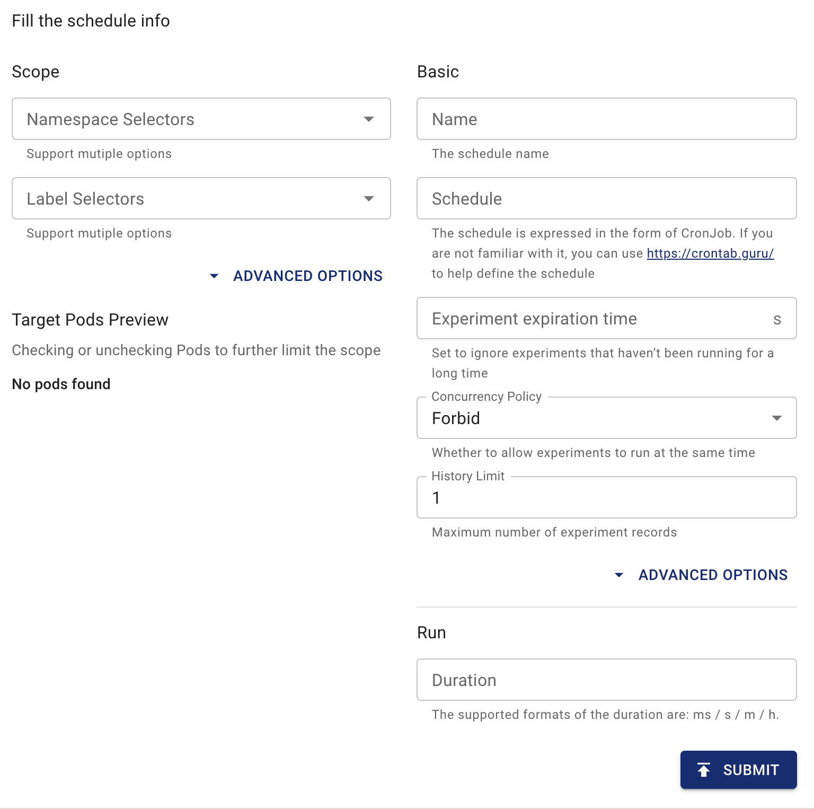

## スケジュール概要

このドキュメントでは、Chaos Meshを使用してスケジュールされたタスクを作成する方法について説明します。これにより、固定時間（または固定間隔）でChaos実験を自動的に作成できます。

Kubernetesでは、Chaos Meshは`Schedule`を使用してスケジュールされたタスクを記述します。

:::note

`Schedule`オブジェクトの名前は57文字を超えてはいけません。なぜなら、作成されたChaos実験は名前の末尾に6文字のランダムな文字を追加するためです。`Workflow`を使用する`Schedule`オブジェクトの名前は51文字を超えてはいけません。なぜならWorkflowは名前の末尾に6文字のランダムな文字を追加するためです。

:::

## YAMLファイルを使用して`kubectl`でスケジュールルールを作成

例えば、毎時5分目に12秒間100ミリ秒の遅延を適用するには、YAMLファイルを次のように設定します：

```yaml
apiVersion: chaos-mesh.org/v1alpha1
kind: Schedule
metadata:
  name: schedule-delay-example
spec:
  schedule: '5 * * * *'
  historyLimit: 2
  concurrencyPolicy: 'Allow'
  type: 'NetworkChaos'
  networkChaos:
    action: delay
    mode: one
    selector:
      namespaces:
        - default
      labelSelectors:
        'app': 'web-show'
    delay:
      latency: '10ms'
      correlation: '100'
      jitter: '0ms'
    duration: '12s'
```

このYAMLファイルを`schedule-networkchaos.yaml`として保存し、`kubectl apply -f ./schedule-networkchaos.yaml`を実行します。

この設定に基づいて、Chaos Meshは毎時5分目（`0:05`、`1:05`など）に次の`NetworkChaos`オブジェクトを作成します：

```yaml
apiVersion: chaos-mesh.org/v1alpha1
kind: NetworkChaos
metadata:
  name: schedule-delay-example-xxxxx
spec:
  action: delay
  mode: one
  selector:
    namespaces:
      - default
    labelSelectors:
      'app': 'web-show'
  delay:
    latency: '10ms'
    correlation: '100'
    jitter: '0ms'
  duration: '12s'
```

`Schedule`のフィールドは以下のように説明され、ほとんどがKubernetesの`CronJob`のフィールドと似ています。詳細については、[Kubernetes CronJobのドキュメント](https://kubernetes.io/zh/docs/concepts/workloads/controllers/cron-jobs/)を参照してください。

:::note

`schedule`フィールドのタイムゾーンは、`chaos-controller-manager`のタイムゾーンに従います。

:::

### `schedule`フィールド

`schedule`フィールドは、実験を実行する時間を指定するために使用されます。言い換えれば、スケジュールの別名はcronジョブです：

```txt
# ┌───────────── minute (0 - 59)
# │ ┌───────────── hour (0 - 23)
# │ │ ┌───────────── day of the month (1 - 31)
# │ │ │ ┌───────────── month (1 - 12)
# │ │ │ │ ┌───────────── day of the week (0 - 6) (Sunday to Saturday; 7 is also Sunday on some systems)
# │ │ │ │ │
# │ │ │ │ │
# │ │ │ │ │
# * * * * * <command to execute>
```

> この図はhttps://en.wikipedia.org/wiki/Cronから引用しています。

Chaos Meshは内部的に[robfig/cron/v3](https://pkg.go.dev/github.com/robfig/cron/v3)を使用して、`schedule`フィールドをcron式に変換します。

:::tip

スケジュールを生成する必要がある場合は、[crontab.guru](https://crontab.guru)などのWebツールを使用できます。

:::

#### 事前定義されたスケジュール

通常の構文に加えて、いくつかの事前定義されたスケジュールもあります。cron式の代わりに、以下の事前定義されたスケジュールのいずれかを使用できます：

| Entry                  | Description                                | Equivalent To |
| ---------------------- | ------------------------------------------ | ------------- |
| @yearly (or @annually) | Run once a year, midnight, Jan. 1st        | 0 0 1 1 \*    |
| @monthly               | Run once a month, midnight, first of month | 0 0 1 \* \*   |
| @weekly                | Run once a week, midnight between Sat/Sun  | 0 0 \* \* 0   |
| @daily (or @midnight)  | Run once a day, midnight                   | 0 0 \* \* \*  |
| @hourly                | Run once an hour, beginning of hour        | 0 \* \* \* \* |

> この表はhttps://pkg.go.dev/github.com/robfig/cron/v3#hdr-Predefined_schedulesから引用しています。

#### インターバル

また、ジョブを固定間隔で実行するようにスケジュールすることもできます。これは、cron仕様を次のようにフォーマットすることでサポートされます：

```txt
@every <duration>
```

例えば、`@every 1h30m10s`は、1時間30分10秒後にアクティブになり、その後はその間隔ごとにアクティブになるスケジュールを示します。

:::info

`インターバル`の内容はhttps://pkg.go.dev/github.com/robfig/cron/v3#hdr-Intervalsから引用しています。詳細については公式ドキュメントを参照してください。

:::

### `historyLimit`フィールド

実験が終了した後、対応する履歴は削除されません。これにより、エラーが発生した場合に結果を簡単に取得して観察できます。`historyLimit`に設定された数は、予約されたタスクの数です。この数には進行中のタスクも含まれます。Chaos Meshは実行中のタスクを削除しません。

`historyLimit`を超えるタスクが存在する場合、Chaos Meshは最も古いタスクから順番に削除します。それらのタスクがまだ実行中の場合、スキップされ削除されません。

### `concurrencyPolicy`フィールド

このフィールドに指定可能な値は`"Forbid"`、`"Allow"`、`""`です。

このフィールドは、この`Schedule`オブジェクトが複数の同時実行実験を作成することを許可するかどうかを指定するために使用されます。例えば、`schedule: * * * * *`設定では、毎分1つの実験が作成されます。実験の`duration`が70秒に設定されている場合、複数の実験が同時に作成されることになります。

デフォルトでは、`concurrencyPolicy`フィールドは`Forbid`に設定されており、複数の実験を同時に作成することは許可されません。`concurrencyPolicy`フィールドの値を`Allow`に設定すると、複数の実験を同時に作成することが許可されます。

以下の設定では、遅延実験を例として使用しています：

```yaml
spec:
  schedule: '* * * * *'
  type: 'NetworkChaos'
  networkChaos:
    action: delay
    mode: one
    selector:
      namespaces:
        - default
      labelSelectors:
        'app': 'web-show'
    delay:
      latency: '10ms'
    duration: '70s'
```

この設定に基づいて、`concurrencyPolicy: "Allow"`を設定すると、毎分10秒間20ミリ秒の遅延が発生し、残りの50秒間は10ミリ秒の遅延が発生します。`concurrencyPolicy: "Forbid"`を設定すると、常に10ミリ秒の遅延が発生します。

:::note

すべての実験タイプが同じPod上での複数実験をサポートしているわけではありません。詳細については、特定の実験タイプのドキュメントを参照してください。

:::

### `startingDeadlineSeconds`フィールド

`startingDeadlineSeconds`のデフォルト値は`nil`です。

`startingDeadlineSeconds`が`nil`に設定されている場合、Chaos Meshは最後のスケジューリング時点から現在までの間に見逃された実験がないかどうかをチェックします（これは、Chaos Meshを閉じた場合、長時間Scheduleを一時停止した場合、または`concurrencyPolicy`を`Forbid`に設定した場合に発生する可能性があります）。

`startingDeadlineSeconds`が設定され、`0`より大きい場合、Chaos Meshは現在時刻から過去`startingDeadlineSeconds`秒間の間に見逃された実験がないかどうかをチェックします。`startingDeadlineSeconds`の値が小さすぎると、一部の実験が見逃される可能性があります。例えば：

```yaml
spec:
  schedule: '* * * * *'
  type: 'NetworkChaos'
  networkChaos:
    action: delay
    mode: one
    selector:
      namespaces:
        - default
      labelSelectors:
        'app': 'web-show'
    startingDeadlineSeconds: 5
    delay:
      latency: '10ms'
    duration: '70s'
```

上記の例では、`concurrencyPolicy`が`Forbid`に設定されているため、分の開始時に新しいタスクの作成が禁止されます。そしてこの分の10秒目に、最後に作成されたChaos実験の実行が終了します。しかし、`startingDeadlineSeconds`の制限と`concurrencyPolicy`の設定により、見逃されたイベントは取得されず、新しいChaos実験は作成されません。新しいChaos実験は次の分の開始時にのみ作成されます。

`startingDeadlineSeconds`が設定されていない（または`nil`に設定されている）場合、常に10ミリ秒の遅延が発生します。これは、実行中のタスクが終了した後、Chaos Meshが以前に見逃されたタスク（`concurrencyPolicy`が`Forbid`に設定されているため）を発見し、すぐに新しいタスクを作成するためです。

このフィールドの詳細な例と説明については、[Kubernetes CronJobドキュメント](https://kubernetes.io/zh/docs/concepts/workloads/controllers/cron-jobs/#cron-job-limitations)を参照してください。

### 実験の定義

実験の具体的な内容を定義するには、`Schedule`内の2つのフィールド`type`と`*Chaos`を指定する必要があります。`type`フィールドは実験のタイプを指定するために使用され、`*Chaos`フィールドは実験の内容を記述するために使用されます。通常、`type`フィールドの内容はアッパーキャメルケース（例：`NetworkChaos`、`PodChaos`、`IOChaos`）を使用します。一方、`*Chaos`のキーはローワーキャメルケース（例：`networkChaos`、`podChaos`、`ioChaos`）を使用します。`*Chaos`のキーは、対応するタイプの実験の`spec`です。詳細については、特定の実験タイプのドキュメントを参照してください。

## Chaos Dashboardを使用したスケジューリングルールの作成

1. Chaos Dashboardを開き、ページ上の**NEW EXPERIMENT**をクリックして新しい実験を作成します。

   

2. 実験の具体的な詳細を選択し、入力します。

   

3. 計画サイクルや並行性戦略を含む情報を入力します。

   

4. 実験情報を送信します。

### スケジュールされたタスクを一時停止する

`CronJob`とは異なり、`Schedule`を一時停止すると、新しい実験の作成が防止されるだけでなく、既に作成された実験も一時停止されます。

現在のところスケジュールされたタスクとしてChaos実験を作成したくない場合は、`Schedule`オブジェクトに`experiment.chaos-mesh.org/pause=true`アノテーションを追加する必要があります。`kubectl`コマンドを使用してアノテーションを追加できます：

```bash
kubectl annotate -n $NAMESPACE schedule $NAME experiment.chaos-mesh.org/pause=true
```

コマンド内の`$NAMESPACE`は名前空間、`$NAME`は`Schedule`の名前です。成功した結果は以下のように返されます：

```bash
schedule/$NAME annotated
```

タスクの一時停止を解除したい場合は、以下のコマンドを使用してアノテーションを削除できます：

```bash
kubectl annotate -n $NAMESPACE schedule $NAME experiment.chaos-mesh.org/pause-
```

コマンド内の`$NAMESPACE`は名前空間、`$NAME`は`Schedule`の名前です。成功した結果は以下のように返されます：

```bash
schedule/$NAME annotated
```