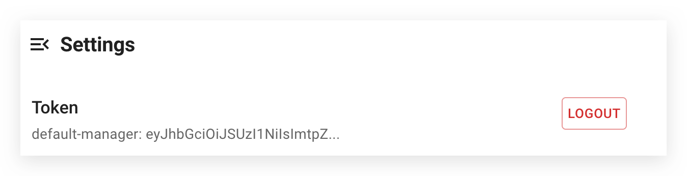

import PickHelmVersion from '@site/src/components/PickHelmVersion'

このドキュメントでは、Chaos Meshにおけるユーザー権限の管理方法について説明します。これには、異なるロールを持つユーザーアカウントの作成、ユーザーアカウントへの権限の紐付け、トークンの管理、および権限認証の有効化・無効化が含まれます。

Chaos Meshは[RBAC認可](https://kubernetes.io/docs/reference/access-authn-authz/rbac/)を使用してユーザー権限を管理します。カオス実験の作成、表示、管理を行うには、ユーザーは`chaos-mesh.org`の`apiGroups`において、カオス実験のリソースを参照する適切な権限を持っている必要があります。

:::caution

Chaos Meshでは権限認証を無効にすることが可能です。無効化する方法については、[権限認証の有効化または無効化](#enable-or-disable-permission-authentication)を参照してください。

**ただし、本番環境で権限認証を無効にすることは推奨しません。**

:::

## ユーザーアカウントの作成と権限の紐付け

Chaos Dashboardを使用して、ユーザーアカウントの作成と権限の紐付けを行うことができます。ダッシュボードにアクセスすると、ログインウィンドウが表示されます。**Click here to generate**リンクをクリックしてください：


リンクをクリックすると、以下のようなToken Generatorが表示されます：


ユーザーアカウントの作成と権限の紐付けの手順は以下の通りです：

### 権限のスコープを選択

クラスター内のすべてのカオス実験に対して適切な権限をアカウントに付与したい場合は、**Cluster scoped**チェックボックスを選択してください。**Namespace**ドロップダウンで特定の名前空間を指定すると、アカウントは指定された名前空間内でのみ権限を持ちます。

要約すると、以下の2つの選択肢があります：

- `Cluster scoped`: アカウントはクラスター内のすべてのカオス実験に対する権限を持ちます。
- `Namespace scoped`: アカウントは指定された名前空間内のすべてのカオス実験に対する権限を持ちます。

### ユーザーのロールを選択

現在、Chaos Meshでは以下のユーザーロールが提供されています：

- `Manager`: カオス実験の作成、表示、更新、削除のすべての権限を持ちます。
- `Viewer`: カオス実験を表示する権限のみを持ちます。

### 権限を生成

権限のスコープとユーザーロールを定義すると、ダッシュボードはToken Generatorに対応するRBAC設定を表示します。例えば、`default`名前空間のマネージャーに対する権限は以下のようになります：

```yaml
kind: ServiceAccount
apiVersion: v1
metadata:
  namespace: default
  name: account-default-manager-vfmot

---
kind: Role
apiVersion: rbac.authorization.k8s.io/v1
metadata:
  namespace: default
  name: role-default-manager-vfmot
rules:
  - apiGroups: ['']
    resources: ['pods', 'namespaces']
    verbs: ['get', 'watch', 'list']
  - apiGroups:
      - chaos-mesh.org
    resources: ['*']
    verbs: ['get', 'list', 'watch', 'create', 'delete', 'patch', 'update']

---
apiVersion: rbac.authorization.k8s.io/v1
kind: RoleBinding
metadata:
  name: bind-default-manager-vfmot
  namespace: default
subjects:
  - kind: ServiceAccount
    name: account-default-manager-vfmot
    namespace: default
roleRef:
  kind: Role
  name: role-default-manager-vfmot
  apiGroup: rbac.authorization.k8s.io
```

設定セクションの右上にある**COPY**をクリックしてRBAC設定をコピーし、内容をローカルに`rbac.yaml`として保存してください。

### ユーザーアカウントを作成し権限を紐付け

ターミナルで以下のコマンドを実行してください：

```bash
kubectl apply -f rbac.yaml
```

:::note

`kubectl`を実行するローカルユーザーがクラスターに対する権限を持っていることを確認してください。これにより、他のユーザーのアカウント作成、権限の紐付け、およびトークンの生成が可能になります。

:::

### トークンを取得

:::info

Kubernetes v1.22以前のバージョンでは、Kubernetes APIにアクセスするための長期的な認証情報が自動的に作成されていました。最近のKubernetesバージョンでは、サービスアカウントトークンSecretを手動で作成する必要があります。

詳細については、[サービスアカウントのAPIトークンを手動で作成する](https://kubernetes.io/docs/tasks/configure-pod-container/configure-service-account/#manually-create-an-api-token-for-a-serviceaccount)を参照してください。

:::

Token Generatorの3番目のステップに表示されるコマンドをコピーし、ターミナルで実行してください。以下はサンプルコマンドです：

```bash
kubectl describe -n default secrets account-default-manager-vfmot
```

出力は以下のようになります：

```log
Name:         account-default-manager-vfmot-token-n4tg8
Namespace:    default
Labels:       <none>
Annotations:  kubernetes.io/service-account.name: account-default-manager-vfmot
              kubernetes.io/service-account.uid: b71b3bf4-cd5e-4efb-8bf6-ff9a55fd7e07

Type:  kubernetes.io/service-account-token

Data
====
ca.crt:     1111 bytes
namespace:  7 bytes
token:      eyJhbG...
```

下部にあるトークンをコピーし、次のステップでログインに使用してください。

## 作成したユーザーアカウントでChaos Dashboardにログイン

**Token Generator**を閉じます。**Token**フィールドに前の手順で取得したトークンを入力し、**Name**フィールドにはトークンに意味のある名前を入力します。権限スコープとユーザーロールを組み合わせた名前（例: `default-manager`）を使用することを推奨します。これら2つのフィールドを入力したら、**Submit**をクリックしてログインします:


:::info

Chaos Dashboardをデプロイしていない場合でも、RBAC設定を手動で生成し、`kubectl`を使用してユーザーアカウントを作成し、権限をバインドすることができます。

:::

## Chaos Dashboardからログアウト

別のトークンに切り替える必要がある場合、Dashboardの左サイドバーにある**Settings**をクリックします:



ページ上部に**Logout**ボタンが表示されます。これをクリックして現在のアカウントからログアウトします。

## FAQ

### 権限認証の有効化または無効化

Chaos MeshをHelmを使用してインストールする場合、デフォルトで権限認証が有効になっています。本番環境やその他の高セキュリティシナリオでは、権限認証を有効にしたままにすることを推奨します。Chaos Meshを試用していて、迅速にカオス実験を作成したい場合は、Helmコマンドで`--set dashboard.securityMode=false`を設定して認証を無効にすることができます。コマンドは以下のようになります:

<PickHelmVersion>
{`helm upgrade chaos-mesh chaos-mesh/chaos-mesh --namespace=chaos-mesh --version latest --set dashboard.securityMode=false`}
</PickHelmVersion>

権限認証を再度有効にしたい場合は、Helmコマンドで`--set dashboard.securityMode=true`を再設定します。