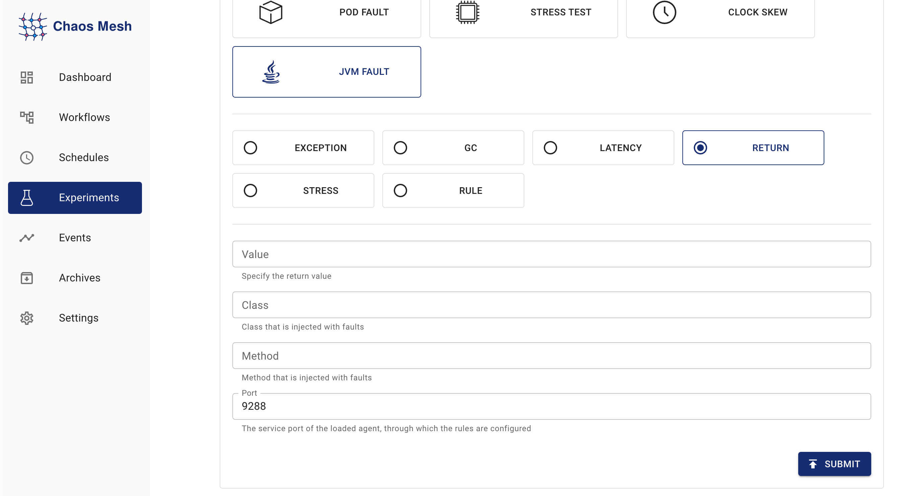

Chaos Meshは[Byteman](https://github.com/chaos-mesh/byteman)を使用してJVMアプリケーションの障害をシミュレートします。サポートされている障害タイプは以下の通りです：

- カスタム例外のスロー
- ガベージコレクションのトリガー
- メソッドレイテンシの増加
- メソッドの戻り値の変更
- Byteman設定ファイルによる障害のトリガー
- JVM負荷の増加

このドキュメントでは、Chaos Meshを使用して上記のJVM実験の障害タイプを作成する方法について説明します。

:::note

Linuxカーネルはv4.1以降である必要があります。

:::

## Chaos Dashboardを使用した実験の作成

1. Chaos Dashboardを開き、ページ上の **NEW EXPERIMENT** をクリックして新しい実験を作成します。

   

2. **Choose a Target** エリアで **JVM FAULT** を選択し、**`RETURN`** などの特定の動作を選択します。その後、詳細な設定を入力します。

   

   設定の入力方法については、[フィールド説明](#field-description)を参照してください。

3. 実験情報を入力し、実験範囲と予定された実験期間を指定します。

   

4. 実験情報を送信します。

## YAMLファイルを使用した実験の作成

以下の例は、JVMChaosの使用方法と効果を示しています。この例では、メソッドの戻り値を指定しています。以下の手順で参照されるYAMLファイルは、[examples/jvm](https://github.com/chaos-mesh/chaos-mesh/tree/master/examples/jvm)にあります。以下の手順のデフォルトの作業ディレクトリも`examples/jvm`です。Chaos Meshがインストールされているデフォルトの名前空間は`chaos-mesh`です。

### ステップ1. ターゲットアプリケーションの作成

[Helloworld](https://github.com/WangXiangUSTC/byteman-example/tree/main/example.helloworld)はシンプルなJavaアプリケーションです。このセクションでは、このアプリケーションをテスト対象として使用します。ターゲットアプリケーションは`example/jvm/app.yaml`で以下のように定義されています：

```yaml
apiVersion: v1
kind: Pod
metadata:
  name: helloworld
  namespace: helloworld
spec:
  containers:
    - name: helloworld
      # source code: https://github.com/WangXiangUSTC/byteman-example/tree/main/example.helloworld
      # this application will print log like this below:
      # 0. Hello World
      # 1. Hello World
      # ...
      image: xiang13225080/helloworld:v1.0
      imagePullPolicy: IfNotPresent
```

1. ターゲットアプリケーションの名前空間を作成します：

   ```shell
   kubectl create namespace helloworld
   ```

2. アプリケーションPodをビルドします：

   ```shell
   kubectl apply -f app.yaml
   ```

3. `kubectl -n helloworld get pods`を実行すると、`helloworld`名前空間に`helloworld`という名前のPodが見つかるはずです。

   ```shell
   kubectl -n helloworld get pods
   ```

   結果は以下のようになります：

   ```text
   kubectl get pods -n helloworld
   NAME         READY   STATUS    RESTARTS   AGE
   helloworld   1/1     Running   0          2m
   ```

   `READY`列が`1/1`になったら、次のステップに進むことができます。

### ステップ2. 障害注入前のアプリケーション動作の観察

障害を注入する前に、`helloworld`アプリケーションの動作を観察できます。例えば：

```shell
kubectl -n helloworld logs -f helloworld
```

結果は以下のようになります：

```shell
0. Hello World
1. Hello World
2. Hello World
3. Hello World
4. Hello World
5. Hello World
```

`helloworld`が毎秒`Hello World`を1行出力し、各行の番号が順番に増加していることがわかります。

### ステップ3. JVMChaosの注入と確認

1. 指定された戻り値を持つJVMChaosの例は以下の通りです:

   ```yaml
   apiVersion: chaos-mesh.org/v1alpha1
   kind: JVMChaos
   metadata:
     name: return
     namespace: helloworld
   spec:
     action: return
     class: Main
     method: getnum
     value: '9999'
     mode: all
     selector:
       namespaces:
         - helloworld
   ```

   JVMChaosは`getnum`メソッドの戻り値を数字`9999`に変更します。これにより、`helloworld`の出力における各行の番号が`9999`に設定されます。

2. 指定された値でJVMChaosを注入:

   ```shell
   kubectl apply -f ./jvm-return-example.yaml
   ```

3. `helloworld`の最新ログを確認:

   ```shell
   kubectl -n helloworld logs -f helloworld
   ```

   ログは以下のようになります:

   ```shell
   Rule.execute called for return_0:0
   return execute
   caught ReturnException
   9999. Hello World
   ```

## フィールド説明

| Parameter | Type | Description | Default value | Required | Example |
| --- | --- | --- | --- | --- | --- |
| `action` | string | Indicates the specific fault type. The available fault types include `latency`, `return`, `exception`, `stress`, `gc`, and `ruleData`. | None | Yes | return |
| `mode` | string | Indicates how to select Pod. The supported modes include `one`, `all`, `fixed`, `fixed-percent`, and `random-max-percent`. | None | Yes | `one` |

異なる`action`値の意味は以下の通りです:

| Value | Meaning |
| --- | --- |
| `latency` | Increase method latency |
| `return` | Modify return values of a method |
| `exception` | Throw custom exceptions |
| `stress` | Increase CPU usage of Java process, or cause memory overflow (support heap overflow and stack overflow) |
| `gc` | Trigger garbage collection |
| `ruleData` | Trigger faults by setting Byteman configuration files |

異なる`action`値に対して、入力可能な設定項目が異なります。

### `latency`のパラメータ

| Parameter | Type | Description | Required |
| --- | --- | --- | --- |
| `class` | string | The name of the Java class | Yes |
| `method` | string | The name of the method | Yes |
| `latency` | int | The duration of increasing method latency. The unit is millisecond. | Yes |
| `port` | int | The port ID attached to the Java process agent. The faults are injected into the Java process through this ID. | No |

### `return`のパラメータ

| Parameter | Type | Description | Required |
| --- | --- | --- | --- |
| `class` | string | The name of the Java class | Yes |
| `method` | string | The name of the method | Yes |
| `value` | string | Specifies the return value of the method. Currently, the item can be numeric and string types. If the item (return value) is string, double quotes are required, like "chaos". | Yes |
| `port` | int | The port ID attached to the Java process agent. The faults are injected into the Java process through this ID. | No |

### `exception`のパラメータ

| Parameter | Type | Description | Required |
| --- | --- | --- | --- |
| `class` | string | The name of the Java class | Yes |
| `method` | string | The name of the method | Yes |
| `exception` | string | The thrown custom exception, such as 'java.io.IOException("BOOM")'. | Yes |
| `port` | int | The port ID attached to the Java process agent. The faults are injected into the Java process through this ID. | No |

### `stress`のパラメータ

| Parameter | Type | Description | Required |
| --- | --- | --- | --- |
| `cpuCount` | int | The number of CPU cores used for increasing CPU stress. You must configure one item between `cpu-count` and `mem-type`. | No |
| `memType` | string | The type of OOM. Currently, both 'stack' and 'heap' OOM types are supported. You must configure one item between `cpu-count` and `mem-type`. | No |
| `port` | int | The port ID attached to the Java process agent. The faults are injected into the Java process through this ID. | No |

### `gc`のパラメータ

| Parameter | Type | Description | Required |
| --- | --- | --- | --- |
| `port` | int | The port ID attached to the Java process agent. The faults are injected into the Java process through this ID. | No |

### `ruleData`のパラメータ

| Parameter | Type | Description | Required |
| --- | --- | --- | --- |
| `ruleData` | string | Specifies the Byteman configuration data | Yes |
| `port` | int | The port ID attached to the Java process agent. The faults are injected into the Java process through this ID. | No |

ルール設定ファイルを作成する際は、特定のJavaプログラムと[byteman-rule-language](https://downloads.jboss.org/byteman/4.0.16/byteman-programmers-guide.html#the-byteman-rule-language)を考慮してください。例:

```txt
RULE modify return value
CLASS Main
METHOD getnum
AT ENTRY
IF true
DO
    return 9999
ENDRULE
```

設定ファイル内の改行を改行文字"\n"にエスケープし、エスケープされたテキストを"rule-data"の値として使用する必要があります:

```txt
\nRULE modify return value\nCLASS Main\nMETHOD getnum\nAT ENTRY\nIF true\nDO return 9999\nENDRULE\n"
```