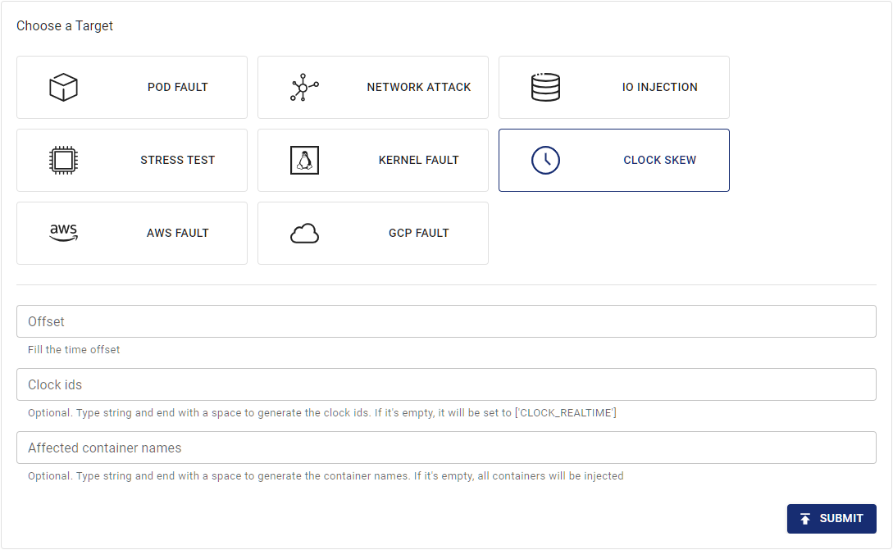

## TimeChaosの概要

Chaos MeshはTimeChaos実験タイプを提供しています。この実験タイプを使用して、時間のオフセットシナリオをシミュレートできます。このドキュメントでは、TimeChaos実験の作成方法と関連する設定ファイルについて説明します。

:::note

TimeChaosは、コンテナのPID名前空間内のPID `1`プロセスとその子プロセスのみに影響を与えます。例えば、`kubectl exec`で起動したプロセスは影響を受けません。

:::

Chaos Dashboardを使用するか、YAML設定ファイルを使用して実験を作成できます。

## Chaos Dashboardを使用した実験の作成

1. Chaos Dashboardを開き、ページ上の **NEW EXPERIMENT** をクリックして新しい実験を作成します:

   

2. **Choose a Target** エリアで、**CLOCK SCREW** を選択し、Clock IDと時間オフセットを入力します。

   

3. 実験情報を入力し、実験範囲と予定された実験期間を指定します:

   

4. 実験情報を送信します。

## YAMLファイルを使用した実験の作成

1. 実験設定をYAML設定ファイルに記述します。以下の例では、`time-shift.yaml`ファイルを使用しています。

   ```yaml
   apiVersion: chaos-mesh.org/v1alpha1
   kind: TimeChaos
   metadata:
     name: time-shift-example
     namespace: chaos-mesh
   spec:
     mode: one
     selector:
       labelSelectors:
         'app': 'app1'
     timeOffset: '-10m100ns'
   ```

   この実験設定は、指定されたPod内のプロセスの時間を10分と100ナノ秒進めます。

2. 設定ファイルの準備ができたら、`kubectl`を使用して実験を作成します:

   ```bash
   kubectl apply -f time-shift.yaml
   ```

YAML設定ファイルの各フィールドの説明は以下の表の通りです:

| Parameter | Type | Note | Default value | Required | Example |
| --- | --- | --- | --- | --- | --- |
| timeOffset | string | Specifies the length of time offset. | None | Yes | `-5m` |
| clockIds | []string | Specifies the ID of clock that will be offset. See the [<clock>clock_gettime</clock> documentation](https://man7.org/linux/man-pages/man2/clock_gettime.2.html) for details. | `["CLOCK_REALTIME"]` | No | `["CLOCK_REALTIME", "CLOCK_MONOTONIC"]` |
| mode | string | Specifies the mode of the experiment. The mode options include `one` (selecting a random Pod), `all` (selecting all eligible Pods), `fixed` (selecting a specified number of eligible Pods), `fixed-percent` (selecting a specified percentage of Pods from the eligible Pods), and `random-max-percent` (selecting the maximum percentage of Pods from the eligible Pods). | None | Yes | `one` |
| value | string | Provides parameters for the `mode` configuration, depending on `mode`.For example, when `mode` is set to `fixed-percent`, `value` specifies the percentage of Pods. | None | No | 1 |
| containerNames | []string | Specifies the name of the container into which the fault is injected. | None | No | `["nginx"]` |
| selector | struct | Specifies the target Pod. For details, refer to [Define the experiment scope](./define-chaos-experiment-scope.md). | None | Yes |  |