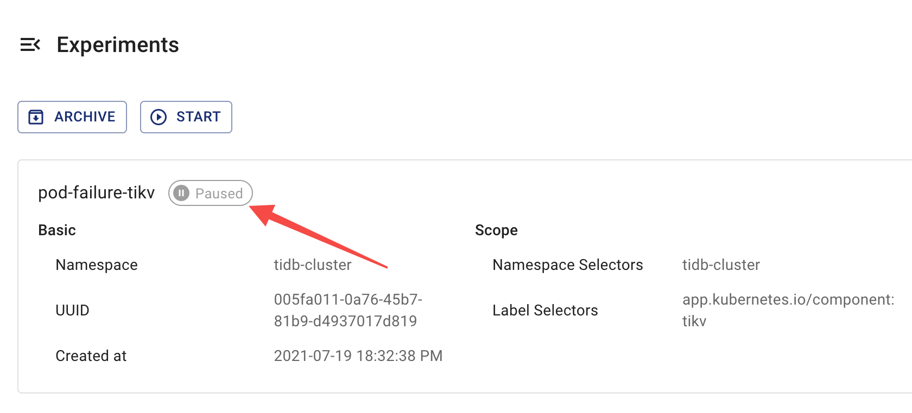

このドキュメントでは、Chaos Meshを使用してカオス実験の実行状態と結果を確認する方法について説明します。

## カオス実験のステップ概要

Chaos Meshでは、カオス実験のライフサイクルは実行プロセスに基づいて4つのステップに分かれています：

- 注入中（Injecting）: カオス実験が障害注入プロセス中である状態。通常、このステップは短時間で終了します。もし「注入中」ステップが長時間続く場合、カオス実験に何らかの異常が発生している可能性があります。この場合、`Events`を確認して異常の原因を調査できます。
- 実行中（Running）: すべてのターゲットPodに障害が正常に注入された後、カオス実験が実行を開始した状態。
- 一時停止（Paused）: 実行中のカオス実験に対して[一時停止](run-a-chaos-experiment.md#pause-chaos-experiments)プロセスを実行すると、Chaos MeshはすべてのターゲットPodから注入された障害を復元し、実験が一時停止したことを示します。
- 終了（Finished）: 実験の`duration`パラメータが設定されており、その時間が経過すると、Chaos MeshはすべてのターゲットPodから注入された障害を復元し、実験が終了したことを示します。

## Chaos Dashboardを使用した結果確認

Chaos Dashboardでは、以下のいずれかのページでカオス実験の実行ステップを確認できます：

- カオス実験の一覧:

  

- カオス実験の詳細:

  

:::note

- **「注入中」**ステップが長時間続く場合、カオス実験に何らかの異常（例：設定されたセレクタが障害を注入するターゲットPodを選択できていない）が発生している可能性があります。この場合、**`Events`**を確認して異常の原因を調査し、カオス実験の設定を確認してください。
- Chaos Dashboardは[カオス実験の主要ステップ](#introduction-to-steps-of-a-chaos-experiment)のみを表示します。実験ステータスと結果に関するより詳細な情報が必要な場合は、`kubectl`コマンドを実行してください。

:::

## `kubectl`コマンドを使用した結果確認

カオス実験の結果を確認するには、以下の`kubectl describe`コマンドを使用して実験オブジェクトの`Status`と`Events`を確認します。

```shell
kubectl describe podchaos pod-failure-tikv -n tidb-cluster
```

期待される出力は以下の通りです：

```shell
...
Status:
  Conditions:
    Reason:
    Status:  False
    Type:    Paused
    Reason:
    Status:  True
    Type:    Selected
    Reason:
    Status:  True
    Type:    AllInjected
    Reason:
    Status:  False
    Type:    AllRecovered
  Experiment:
    Container Records:
      Id:            tidb-cluster/basic-tikv-0
      Phase:         Injected
      Selector Key:  .
    Desired Phase:   Run
Events:
  Type    Reason           Age   From          Message
  ----    ------           ----  ----          -------
  Normal  FinalizerInited  39s   finalizer     Finalizer has been inited
  Normal  Paused           39s   desiredphase  Experiment has been paused
  Normal  Updated          39s   finalizer     Successfully update finalizer of resource
  Normal  Updated          39s   records       Successfully update records of resource
  Normal  Updated          39s   desiredphase  Successfully update desiredPhase of resource
  Normal  Started          17s   desiredphase  Experiment has started
  Normal  Updated          17s   desiredphase  Successfully update desiredPhase of resource
  Normal  Applied          17s   records       Successfully apply chaos for tidb-cluster/basic-tikv-0
  Normal  Updated          17s   records       Successfully update records of resource
```

上記の出力は2つの部分で構成されています：

- `Status`

  カオス実験の実行プロセスに基づき、`Status`には4種類のステータス記録が提供されます：

  - `Paused`: カオス実験が「一時停止」ステップにあることを示します。
  - `Selected`: カオス実験が障害を注入するターゲットPodを正しく選択したことを示します。
  - `AllInjected`: すべてのターゲットPodに障害が正常に注入されたことを示します。
  - `AllRecoverd`: 注入された障害がすべてのターゲットPodから正常に復元されたことを示します。

  これらの4種類のステータス記録から、現在のカオス実験の実際の実行状態を推測できます。例えば：

  - `Paused`、`Selected`、`AllRecoverd`が`True`で`AllInjected`が`False`の場合、現在のカオス実験が一時停止中であることを示します。
  - `Paused`が`True`の場合、現在のカオス実験が一時停止中であることを示します。ただし、同時に`Selected`が`False`の場合、現在の実験が障害を注入するターゲットPodを選択できないことを意味します。

  :::note

  上記のステータス記録の組み合わせからより多くの情報を得ることができます。例えば、`Paused`が`True`の場合、実験が一時停止中であることを示しますが、同時に`Selected`が`False`の場合、現在の実験が障害を注入するターゲットPodを選択できないことを意味します。

  :::

- `Events`

  これにはカオス実験のライフサイクル全体を通じて実行されたアクションの記録が含まれており、実験ステータスの確認や問題のトラブルシューティングに役立ちます。