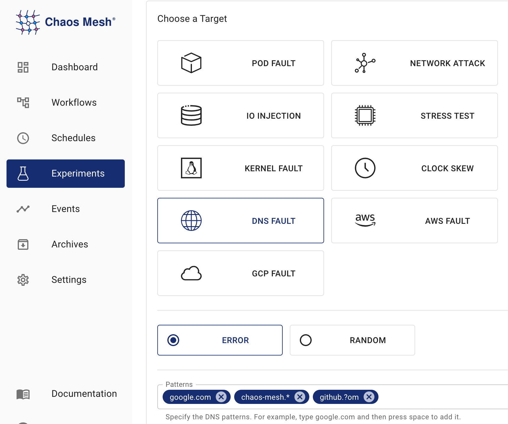

import PickHelmVersion from '@site/src/components/PickHelmVersion'

このドキュメントでは、Chaos MeshでDNS障害をシミュレートするDNSChaos実験の作成方法について説明します。

:::info

DNS障害をシミュレートするには、Chaos DNS Serverと呼ばれる特別なDNSサービスをデプロイする必要があります。

`v2.6`以降、Chaos MeshはデフォルトでChaos DNS Serverをデプロイします。DNS障害のシミュレーションが必要ない場合は、Chaos Meshのインストール時に`dnsServer.create`を`false`に設定できます:

<PickHelmVersion>{`helm install chaos-mesh chaos-mesh/chaos-mesh --namespace=chaos-mesh --version latest --set dnsServer.create=false`}</PickHelmVersion>

:::

## DNSChaosの概要

DNSChaosは、誤ったDNS応答をシミュレートするために使用されます。例えば、DNSChaosはDNSリクエストを受信した際にエラーを返したり、ランダムなIPアドレスを返したりすることができます。

## Chaos DNS Serverのデプロイ確認

以下のコマンドを実行して、Chaos DNS Serverがデプロイされているか確認します:

```bash
kubectl get pods -n chaos-mesh -l app.kubernetes.io/component=chaos-dns-server
```

Podのステータスが`Running`であることを確認してください。

## 注意事項

1. 現在、DNSChaosはレコードタイプ`A`と`AAAA`のみをサポートしています。

2. chaos DNSサービスは[k8s_dns_chaos](https://github.com/chaos-mesh/k8s_dns_chaos)プラグインを搭載したCoreDNSを実行します。KubernetesクラスターのCoreDNSサービスに特別な設定が含まれている場合は、以下のコマンドを使用してconfigMap `dns-server-config`を編集し、chaos DNSサービスの設定をK8s CoreDNSサービスと一致させることができます:

   ```bash
   kubectl edit configmap dns-server-config -n chaos-mesh
   ```

## Chaos Dashboardを使用した実験の作成

1. Chaos Dashboardを開き、ページ上の**NEW EXPERIMENT**をクリックして新しい実験を作成します:

   

2. **Choose a Target**エリアで、**DNS FAULT**を選択し、**ERROR**などの特定の動作を選択します。その後、マッチングルールを入力します。

   

   スクリーンショットで設定されたマッチングルールに従い、`google.com`、`chaos-mesh.org`、`github.com`を含むドメインに対してDNS FAULTが有効になります。これは、これらの3つのドメインにDNSリクエストが送信された際にエラーが返されることを意味します。具体的なマッチングルールの詳細については、[設定説明](#configuration-description)の`patterns`フィールドの説明を参照してください。

3. 実験情報を入力し、実験範囲と予定された実験期間を指定します:

   

4. 実験情報を送信します。

## YAMLファイルを使用した実験の作成

1. 実験設定を`dnschaos.yaml`ファイルに記述します:

   ```yaml
   apiVersion: chaos-mesh.org/v1alpha1
   kind: DNSChaos
   metadata:
     name: dns-chaos-example
     namespace: chaos-mesh
   spec:
     action: random
     mode: all
     patterns:
       - google.com
       - chaos-mesh.*
       - github.?om
     selector:
       namespaces:
         - busybox
   ```

   この設定は、`google.com`、`chaos-mesh.org`、`github.com`を含むドメインに対して有効になります。これは、これらの3つのドメインにDNSリクエストが送信された際にIPアドレスが返されることを意味します。具体的なマッチングルールについては、[設定説明](#configuration-description)の`patterns`の説明を参照してください。

2. 設定ファイルの準備ができたら、`kubectl`を使用して実験を作成します:

   ```bash
   kubectl apply -f dnschaos.yaml
   ```

### 設定説明

| Parameter | Type | Description | Default value | Required | Example |
| :-- | :-- | :-- | :-- | :-- | :-- |
| `action` | string | Defines the behavior of DNS fault. Optional values: `random` or `error`. When the value is `random`, DNS service returns a random IP address; when the value is `error`, DNS service returns an error. | None | Yes | `random` or `error` |
| `patterns` | String array | Selects a domain template that matches faults. Placeholder `?` and wildcard are supported. `*` | [] | No | `google.com`, `chaos-mesh.org`, `github.com` |
| `mode` | string | Specifies the mode of the experiment. The mode options include `one` (selecting a random Pod), `all` (selecting all eligible Pods), `fixed` (selecting a specified number of eligible Pods), `fixed-percent` (selecting a specified percentage of Pods from the eligible Pods), and `random-max-percent` (selecting the maximum percentage of Pods from the eligible Pods). | None | Yes | `one` |
| `value` | string | Provides parameters for the `mode` configuration, depending on `mode`. For example, when `mode` is set to `fixed-percent`, `value` specifies the percentage of Pods. | None | No | `1` |
| `selector` | struct | Specifies the target Pod. For details, refer to [Define the Scope of Chaos Experiments](./define-chaos-experiment-scope.md). | None | Yes |  |

:::note

- `patterns`設定のワイルドカードは文字列の末尾にある必要があります。例えば、`chaos-mes*.org.`は無効な設定です。

- `patterns`が設定されていない場合、すべてのドメインに対して障害が注入されます。

:::