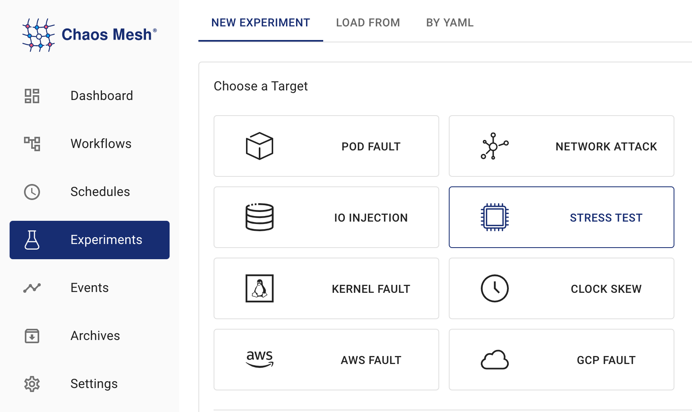

## StressChaosの概要

Chaos Meshは、コンテナ内でストレスシナリオをシミュレートするためのStressChaos実験を提供します。このドキュメントでは、StressChaos実験の作成方法と対応する設定ファイルの準備方法について説明します。

実験は、Chaos DashboardまたはYAML設定ファイルのいずれかを使用して作成できます。

## Chaos Dashboardを使用した実験の作成

1. Chaos Dashboardを開き、ページ上の**NEW EXPERIMENT**をクリックして新しい実験を作成します：

   

2. **Choose a Target**エリアで、**STRESS TEST**を選択し、実験情報を入力します。具体的な設定フィールドについては、[設定説明](#fields description)の説明を参照してください。

   

3. 実験情報を入力し、実験範囲と予定された実験期間を指定します：

   

4. 実験情報を送信します。

## YAMLファイルを使用した実験の作成

1. 実験設定をYAML設定ファイルに記述します。以下の例では、`memory-stress.yaml`ファイルを使用しています。

   ```yaml
   apiVersion: chaos-mesh.org/v1alpha1
   kind: StressChaos
   metadata:
     name: memory-stress-example
     namespace: chaos-mesh
   spec:
     mode: one
     selector:
       labelSelectors:
         'app': 'app1'
     stressors:
       memory:
         workers: 4
         size: '256MB'
   ```

   この実験設定は、選択したコンテナ内でプロセスを作成し、メモリを継続的に割り当てて読み書きを行い、最大256MBのメモリを占有します。

2. 設定ファイルの準備が完了したら、`kubectl`を使用して実験を作成します：

   ```bash
   kubectl apply -f memory-stress.yaml
   ```

### フィールド説明

YAML設定ファイルのフィールドは、以下の表で説明されています：

| Parameter | Type | Description | Default value | Required | Example |
| --- | --- | --- | --- | --- | --- |
| duration | string | Specifies the duration of the experiment. | None | Yes | `30s` |
| stressors | [Stressors](#stressors) | Specifies the stress of CPU or memory | None | No |  |
| stressngStressors | string | Specifies the stres-ng parameter to reach richer stress injection | None | No | `--clone 2` |
| mode | string | Specifies the mode of the experiment. The mode options include `one` (selecting a random Pod), `all` (selecting all eligible Pods), `fixed` (selecting a specified number of eligible Pods), `fixed-percent` (selecting a specified percentage of Pods from the eligible Pods), and `random-max-percent` (selecting the maximum percentage of Pods from the eligible Pods). | None | Yes | `one` |
| value | string | Provides a parameter for the `mode` configuration, depending on `mode`.For example, when `mode` is set to `fixed-percent`, `value` specifies the percentage of Pods. | None | No | 1 |
| containerNames | []string | Specifies the name of the container into which the fault is injected. | None | No | `["nginx"]` |
| selector | struct | Specifies the target Pod. For details, refer to [Define the Scope of Chaos Experiments](./define-chaos-experiment-scope.md). | None | Yes |  |

#### Stressors

| Parameter | Type                              | Description                 | Default value | Required | Example |
| --------- | --------------------------------- | --------------------------- | ------------- | -------- | ------- |
| memory    | [MemoryStressor](#memorystressor) | Specifies the memory stress | None          | No       |         |
| cpu       | [CPUStressor](#cpustressor)       | Specifies the CPU stress    | None          | No       |         |

##### MemoryStressor

| Parameter | Type | Description | Default value | Required | Example |
| --- | --- | --- | --- | --- | --- |
| workers | int | Specifies the number of threads that apply memory stress |  | No | `1` |
| size | string | Specifies the memory size to be occupied or a percentage of the total memory size. The final sum of the occupied memory size is `size`. |  | No | `256MB / 25%` |
| time | string | Specifies the time to reach the memory `size`. The growth model is a linear model. |  | No | `10min` |
| oomScoreAdj | int | Specifies the [oom_score_adj](https://man7.org/linux/man-pages/man5/proc.5.html) of the stress process. |  | No | `-1000` |

:::note

`stress-ng`による読み書き圧力による高いCPU負荷を避けるため、Chaos Meshは[memStress](https://github.com/chaos-mesh/memStress)を使用してメモリストレスをシミュレートします。これは、memStressがメモリへの読み書き圧力を適用する代わりに、実際のメモリを消費することでメモリストレスをシミュレートするためです。

:::

##### CPUStressor

| Parameter | Type | Description | Default value | Required | Example |
| --- | --- | --- | --- | --- | --- |
| workers | int | Specifies the number of threads that apply CPU stress |  | Yes | `1` |
| load | int | Specifies the percentage of CPU occupied. `0` means that no additional CPU is added, and `100` refers to full load. The final sum of CPU load is `workers * load`. |  | No | `50` |