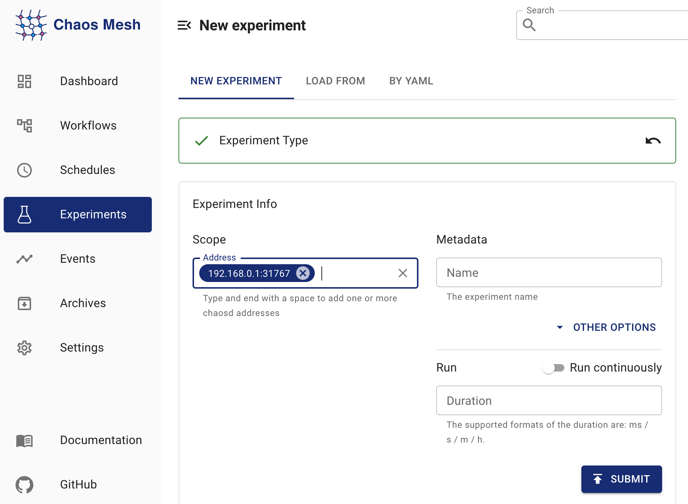

このドキュメントでは、Chaos MeshでPhysicalMachineChaos（物理マシンカオス）実験を作成し、物理マシンまたは仮想マシンにおけるネットワーク、ディスク、負荷、JVM、時間などの障害をシミュレートする方法について説明します。

## PhysicalMachineChaosの概要

PhysicalMachineChaosを使用すると、物理マシンまたは仮想マシンにおけるネットワーク、ディスク、負荷、JVM、時間などの障害をシミュレートできます。Chaos Meshが提供するPhysicalMachineChaosを使用する前に、物理マシンまたは仮想マシンにChaosdをデプロイする必要があります。Chaos MeshとChaosdのバージョンマッピングは以下の通りです：

| Chaos Mesh version | Chaosd version |
| :----------------- | :------------- |
| v2.1.x             | v1.1.x         |
| v2.2.x             | v1.2.x         |

## Chaosdサーバーのデプロイ

Chaos Meshを使用してPhysicalMachineChaos実験を作成する前に、障害を注入する予定のすべての物理マシンまたは仮想マシンにChaosdをサービスモードでデプロイする必要があります。Chaosdをデプロイした後、以下のようにChaosdサーバーを実行します：

1. Chaosdをデプロイし、TLS証明書を生成し、`PhysicalMachine`を作成します：

   - Chaosdのデプロイ方法については、[Chaosdのダウンロードとデプロイ](chaosd-overview.md#download-and-deploy)を参照してください。
   - Chaosdをデプロイした後、Chaosdサーバーを起動する**前に**、TLS証明書を生成し、Kubernetesクラスター内に`PhysicalMachine`を作成する必要があります。TLS証明書の生成方法の詳細については、[Chaosd用TLS証明書の生成](chaosctl-tool.md#generate-tls-certificates-for-chaosd)を参照してください。

2. Chaosdサーバーを起動します：

   - Chaosctlを使用してTLS証明書を生成した後、以下のコマンドを実行してChaosdをサービスモードで起動します：

     ```bash
     chaosd server --https-port 31768 --CA=/etc/chaosd/pki/ca.crt --cert=/etc/chaosd/pki/chaosd.crt --key=/etc/chaosd/pki/chaosd.key
     ```

     :::note

     TLS証明書はChaosctlのデフォルト出力ディレクトリに保存されます。証明書生成時に別のディレクトリを手動で指定した場合は、コマンドラインのディレクトリを対応するものに置き換えてください。

     :::

- TLS証明書をChaosctlを使用せずに生成した場合、以下のコマンドを実行してChaosdをサービスモードで起動できます。ただし、クラスターのセキュリティのため、この方法は**推奨されません**。

  ```bash
  chaosd server --port 31767
  ```

## Chaos Dashboardを使用した実験の作成

1. Chaos Dashboardを開き、ページ上の**NEW EXPERIMENT**をクリックして新しい実験を作成します：

   

2. **Experiment Type**で**PHYSIC**をクリックし、**NETWORK ATTACK**などの特定の実験タイプを選択します。その後、特定の動作を選択し、対応する設定を入力します：

   

3. 実験の範囲と予定された期間を指定するために、実験情報を入力します：

   

4. 実験を送信します。

## YAMLファイルを使用した実験の作成

1. 実験設定を「physicalmachine.yaml」ファイルに記述します。例：

   ```yaml
   apiVersion: chaos-mesh.org/v1alpha1
   kind: PhysicalMachineChaos
   metadata:
     name: physical-network-delay
     namespace: chaos-mesh
   spec:
     action: network-delay
     mode: one
     selector:
       namespaces:
         - default
       labelSelectors:
         'arch': 'amd64'
     network-delay:
       device: ens33
       ip-address: 140.82.112.3
       latency: 1000ms
     duration: '10m'
   ```

   上記の実験設定は、指定された物理マシンまたは仮想マシン内のChaosdサービスにHTTPリクエストを送信し、ネットワーク遅延実験をトリガーします。

2. `kubectl`を使用して実験を作成します。コマンドは以下の通りです：

   ```bash
   kubectl apply -f physicalmachine.yaml
   ```

### 設定の説明

| Configuration item | Type | Description | Default value | Required | Example |
| :-- | :-- | :-- | :-- | :-- | :-- |
| `action` | string | Defines the actions of physical machines faults, optional values are as follows: `stress-cpu`, `stress-mem`, `disk-read-payload`, `disk-write-payload`, `disk-fill`, `network-corrupt`, `network-duplicate`, `network-loss`, `network-delay`, `network-partition`, `network-dns`, `process`, `jvm-exception`, `jvm-gc`, `jvm-latency`, `jvm-return`, `jvm-stress`, `jvm-rule-data`, `clock` | None | Yes | `stress-cpu` |
| `address` | string array | Selects the `address` of Chaosd service to inject faults, only one of `address` or `selector` could be specified | [] | Yes | ["192.168.0.10:31767"] |
| `selector` | struct | Specifies the target PhysicalMachine. For details, refer to [Define the experiment scope](define-chaos-experiment-scope.md), only one of `address` or `selector` could be specified | None | No |  |
| `mode` | string | Specifies the mode of the experiment. The mode options include `one` (selecting a random PhysicalMachine), `all` (selecting all eligible PhysicalMachines), `fixed` (selecting a specified number of eligible PhysicalMachines), `fixed-percent` (selecting a specified percentage of PhysicalMachines from the eligible PhysicalMachines), and `random-max-percent` (selecting the maximum percentage of PhysicalMachines from the eligible PhysicalMachines). | None | Yes | `one` |
| `value` | string | Provides a parameter for the `mode` configuration, depending on `mode`. For example, when `mode` is set to `fixed-percent`, `value` specifies the percentage of PhysicalMachines. | None | No | `1` |
| `duration` | string | Specifies the duration of experiments | None | Yes | `30s` |

各障害アクションには独自の特定の設定があります。以下のセクションでは、さまざまな障害タイプとそれらに対応する設定方法を紹介します。

#### CPU負荷

CPU負荷シナリオをシミュレートするには、アクションを「stress-cpu」に設定します。対応する設定については、CPU負荷シミュレーションのパラメータを参照してください。

#### メモリ負荷

メモリ負荷シナリオをシミュレートするには、アクションを「stress-mem」に設定します。対応する設定については、メモリ負荷シミュレーションのパラメータを参照してください。

#### ディスク読み込み負荷

ディスク読み込み負荷シナリオをシミュレートするには、アクションを「disk-read-payload」に設定します。対応する設定については、ディスク読み込み負荷シミュレーションのパラメータを参照してください。

#### ディスク書き込み負荷

ディスク書き込み負荷シナリオをシミュレートするには、アクションを「disk-write-payload」に設定します。対応する設定については、ディスク書き込み負荷シミュレーションのパラメータを参照してください。

#### ディスク容量逼迫

ディスク容量逼迫シナリオをシミュレートするには、アクションを「disk-fill」に設定します。対応する設定については、ディスク容量逼迫シミュレーションのパラメータを参照してください。

#### ネットワーク破損

ネットワーク破損シナリオをシミュレートするには、アクションを「network-corrupt」に設定します。対応する設定については、ネットワーク破損シミュレーションのパラメータを参照してください。

#### ネットワーク遅延

ネットワーク遅延シナリオをシミュレートするには、アクションを「network-delay」に設定します。対応する設定については、ネットワーク遅延シミュレーションのパラメータを参照してください。

#### ネットワーク重複

ネットワーク重複シナリオをシミュレートするには、アクションを「network-duplicate」に設定します。対応する設定については、ネットワーク重複シミュレーションのパラメータを参照してください。

#### ネットワーク損失

ネットワーク損失シナリオをシミュレートするには、アクションを「network-loss」に設定します。対応する設定については、ネットワーク損失シミュレーションのパラメータを参照してください。

#### ネットワーク分断

ネットワーク分断シナリオをシミュレートするには、アクションを「network-partition」に設定します。対応する設定については、ネットワーク分断シミュレーションのパラメータを参照してください。

#### DNS障害

DNS障害シナリオをシミュレートするには、アクションを「network-dns」に設定します。対応する設定については、DNS障害シミュレーションのパラメータを参照してください。

#### プロセス障害

プロセス障害シナリオをシミュレートするには、アクションを「process」に設定します。対応する設定については、プロセス障害シミュレーションのパラメータを参照してください。

#### JVMアプリケーションのカスタム例外発生

JVMアプリケーションがカスタム例外を発生させるシナリオをシミュレートするには、アクションを「jvm-exception」に設定します。対応する設定については、カスタム例外発生パラメータを参照してください。

#### JVMアプリケーションのメソッド遅延増加

JVMアプリケーションのメソッド遅延を増加させるシナリオをシミュレートするには、アクションを「jvm-latency」に設定します。対応する設定については、メソッド遅延増加パラメータを参照してください。

#### JVMアプリケーションのメソッド戻り値変更

JVMアプリケーションのメソッド戻り値を変更するシナリオをシミュレートするには、アクションを「jvm-return」に設定します。対応する設定については、メソッド戻り値変更パラメータを参照してください。

#### JVMアプリケーションのガベージコレクション強制実行

JVMアプリケーションのガベージコレクションを強制実行するシナリオをシミュレートするには、アクションを「jvm-gc」に設定します。対応する設定については、ガベージコレクション強制実行パラメータを参照してください。

#### JVMアプリケーションのByteman設定ファイルによる障害発生

JVMアプリケーションがByteman設定ファイルを使用して障害を発生させるシナリオをシミュレートするには、アクションを「jvm-rule-data」に設定します。対応する設定については、Byteman設定ファイルによる障害発生パラメータを参照してください。

#### 時間オフセット

時刻のオフセットをシミュレートするには、アクションを「clock」に設定する必要があります。対応する設定については、時刻オフセットのシミュレーションパラメータを参照してください。